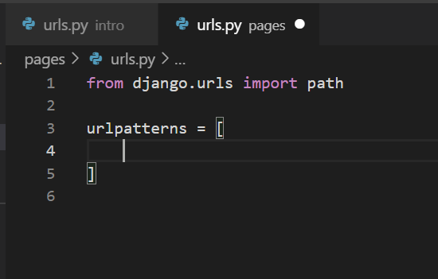
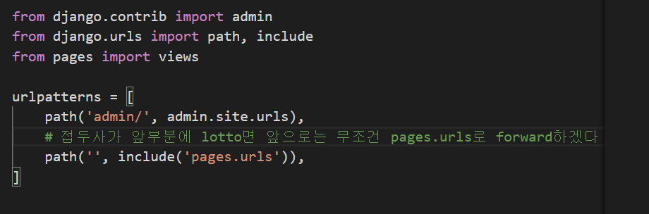
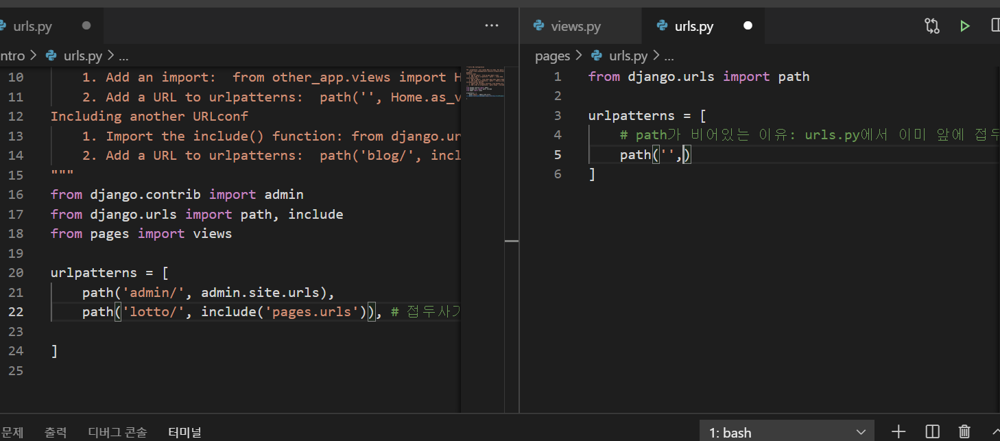
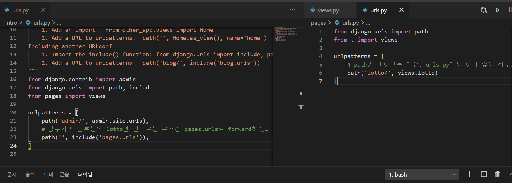
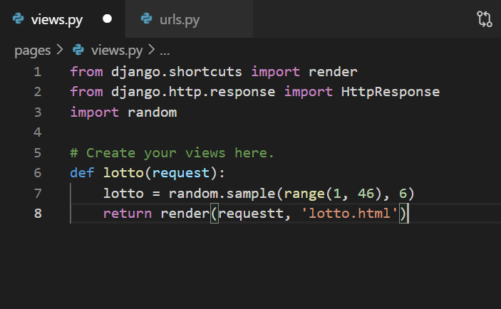
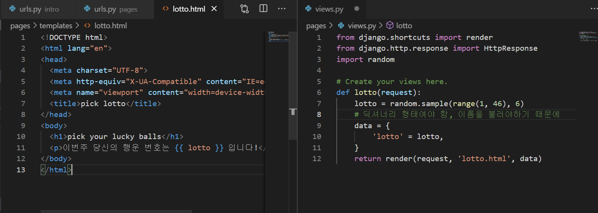
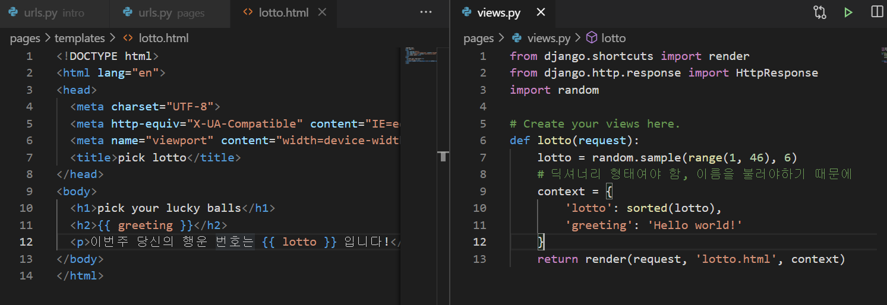
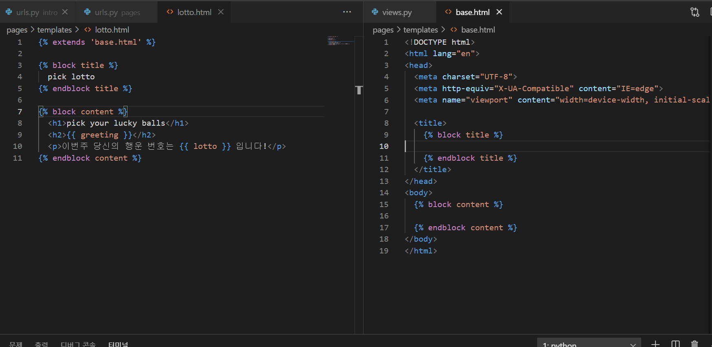
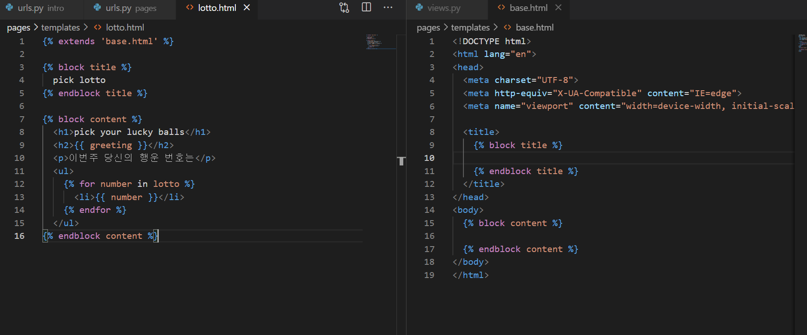

워크샵

settings가 있는 곳이 마스터앱이다

프로젝트 루트는 캐피탈로

프로젝트 루트에서 code로 열기 안하면 가상환경을 못잡을 수 있다.

프레임워크: 틀일

중간중간 양념을 칠 수는 있겠지만 디자인 패턴이 가지고 있는 흐름은 따라야 함

= 틀에 박힌 일

url

-httpresponse를 리턴한다

-view 함수와의 mapping

1 뒤에

mkdir

cd

앱을 만들었다 > 출생신고 (settings py의 installed apps에서)

// 꼭 출생신고가 그 다음이어야함

path 설정

views에서 정의

from pages import views 하고 views.lotto

sample 뒤에 range 필요

url 만들면

include란

import 수정한거 참고

이거 두개는 동일

로또 뒤에 / 필요

접두사 비어있으면 pages.url로 가자는 뜻(비어있는 path는 순서 중요함 만약 이게 맨위에 있으면 다른 경로도 저기로 갈 수 있음)

그다음에 lotto면 views.lotto

!tab > html 자동완성

render

변수 받을때 이미 딕셔너리 해체라서

data['lotto'] 이렇게 할 필요 없음

장고는 DTL을 따름 >  != 파이썬

render(request, 'lotto.html', data) : lotto.html에서 data에 접근

'lotto': lotto, 임!! = 아님!

최종

{{}} 는 print랑 비슷한 기능이라고 생각하면 됨

-----------------

base.html 과 분리하기

반복문 사용하기

