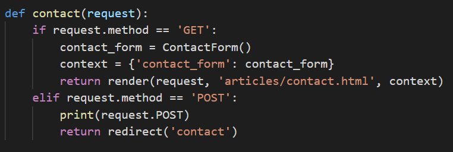
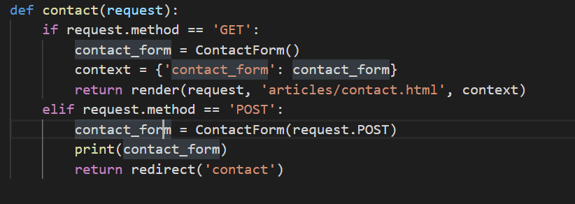

python manage.py makemigrations orm_practice

created_at = models.DataField(auto_now_add = True, null = True)

기본적으로 장고는 빈곳을 굉장히 싫어함

책임 소재가 다름

4 > 책임소재 = client

5 > 책임소재 =  server

import get_object_or_404

student = get_object_or_404(Student, pk = pk)

-> 책임소재ㅡㄹ ㄹ명확하게 하게싿

db 마이그레이션

form을 사용하는 이유

1. data validation()
2. html easy(html을 편하게 해준다)

post오ㅏ csrf는 한세트

as_p : p태그

한 url로 두가지 용도(create를 만들 필요가 없어짐 > 2가지 view함수 필요 x > thin view)

최종적으로는 둘다 html을 받아보겠지만 과정이 다름

- get일 경우(/crud/contact/ 로 접속한 경우)
  - 그러면 너는 html 을 받아가(GET /crud/contact/)
- post인 경우
  - 사용자가 html > form에서 데이터를 제출했다
  - post 요청을 보내면(POST /crud/contact/)
  - view함수의 elif 문에 걸려서
  - 어떤 데이터를 제출했는지 print해보고
  - 다시 contact로 돌아가(GET/crud/contact: 버튼 클릭 아니므로)

이렇게 해서 return 값(value)이 생기므로

이런거 가능(is valid, errors 등)

즉, form이 유효성 검사도 해줌

forms.Form

- 특정 모델과 연동 x
- 단순히 데이터 검증 + html 생성용

특정 모델과 연동하기 위해

from .models import Article

class ArticleForm()...

ModelForm: 모델과 동기히ㅘ하는 FORM

form은 textfield가 없다

이런식으로 widget을 만들어

보기에 textfield 처럼 사용할 수 있다

widget은 그니까 html 생성시 주는 옵션같은거라고 보면 된다

article을 객체처럼 이용할 수 있도록

save()도 이용가능

action이 없을때 디폴트 값은 본래 자리

action 삭제 가능

그치만 post기능있어서 알아서 제출됨

이렇게 되었떠니

edit할때 기존을 수정하지 않고

기존을 가져와서 생성을 하고있어버림

이렇게 수정하자(instance=article)

