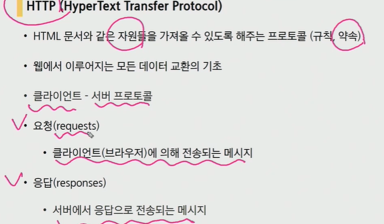
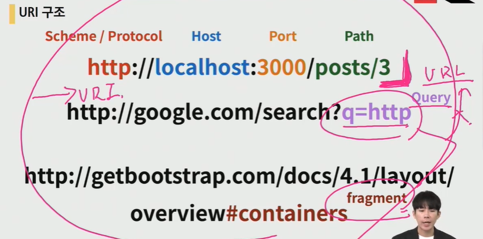
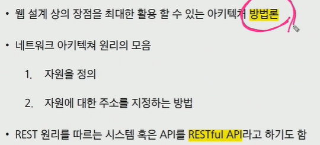

### REST API

#### API

어플리케이션과 프로그래밍으로 소통하는 방법


cli 명령줄로 소통

gui 그래픽, 아이콘으로 소통

api 코드 작성, 프로그래밍으로 소통


#### WEB API

웹 어플리케이션 개발에서 다른 서비스에 요청을 보내고 응답을 받기 위해 정의된 명세

지도 어플 만들때 OPEN API 받아서 사용함


#### API server

프로그래밍을 통한 요청에

json을 응답하는 서버를 만들자(사용자에게 json 데이터를 넘기자)


---------------


#### REST API

##### REST



규칙은 아니고 하나의 방법론

1. resource(data)를 정의
2. resource에 접근하는 주소를 지정하는 방법

rest를 잘 지킨 api가 restful api

> 즉 **자원** 과 **주소**를 정의하는 것


##### REST 구성

자원(URI), 행위(Http method), 표현(Representations)


-------------------------------


##### URI

통합 자원 식별자(Uniform Resource Identifier)

인터넷 자원을 나타내는 주소

인터넷에서 자원을 식별하거나 이름을 지정하는 데 사용되는 간단한 문자열

URL과 URN의 상위개념

```
URI 구조
		IP 주소		 자원의 경로
		 host		   path
	   ---------	  -------
http://localhost:3000/posts/3
----			 -----
scheme/protocol   port
				  자원에 접근하는 기본적 GATE
				  
				  
fragment는 북마크 기능과 비슷하다(해당 문서의 특정 부분을 보여줌, 브라우저에게 알려주는 요소)
```




전체는 URI 근데 path까지는 URL

쿼리와 fragment는 uri에 해당 x


##### URL

통합 자원 위치(Uniform Resource Locator)

예) http:// www.naver.com: 네이버 메인페이지라는 자원이 어디있는지

리소스(html, css, 이미지 등)가 어디있는지(주소)를 알려주기 위한 약속

웹주소, 링크라고도 불림

URL은 사용하는 비중이 매우 적음


##### URN

통합 자원 이름(Uniform Resource Name)

자원의 유일한 이름 역할을 함

자원의 위치가 옮겨져도 문제없이 동작

보통 직접 작성하지는 않음

ex) ISBN 0-486-27557-4


##### URL과 URN의 비교

기존 URL(주소): 서울시 강남구 테헤란로 멀티캠퍼스

만약 멀캠이 이사가면 기존 URL로는 멀캠을 찾을 수 없음

새로운 URL로 찾아야함

하지만 URN은 변경되지 않으므로 멀캠을 검색해서 갈 수는 있음

즉, URN은 자원의 ID를 정의, URL은 자원을 찾는 방법을 제공

상호보완적 관계


##### URI 설계 주의사항

- 밑줄 보다 하이픈 사용(-) for 가독성

- 소문자 사용

- 파일 확장자 포함시키지 X

  

------------------





##### HTTP 특징

- 비연결지향: 서버는 응답후 접속을 끊음
- 무상태: 접속 끊어지면 클라이언트와 서버간의 통신이 끝나며 상태 저장 X

이 두가지 특징을 보완하기 위해 쿠키와 세션을 배웠음

로그인한 사용자임을 계속 알려줌


##### HTTP Method

http: http method를 정의하여 주어진 자원에 수행하길 원하는 행동을 나타냄

의미론적 규정이라 실제 행위가 수행됨을 보장하지 않음

예) GET 요청이 있다고 해서 문서가 주어질거라는 수행을 보장하진 않음


##### HTTP Method 종류

- GET: 특정 자원의 표시를 요청, 오직 데이터 받기만 함
- POST: 서버로 데이터 전송, 서버에 변경사항 만듦
- PUT: 요청한 주소의 자원을 수정
- DELETE: 지정 자원 삭제


##### O, X QUIZ

GET / articles / 1 / read ( X )

read 때문에 X

read는 행위 표현(uri에 불필요한 정보)

주소 자체가 틀렸다기보다 restful 하다고 볼수 없는 것


GET / articles / 1 / delete ( X )

URI 자원에 대한 행위는 HTTP method로 표현해야해서

DELETE / articles / 1  이 옳다


---------------


#### REPRESENTATION

#### json

가벼운 데이터 포맷

자바스크립트 객체 문법을 따르지만 차이가 있음

구조화된 데이터를 표현하기 위한 문자 기반 데이터 포맷

웹어플리케이션 > 클라이언트로 데이터 전송할 때 사용

xml, yaml보다 접근이 쉬움(파이썬 > 딕셔너리로 접근, 자바스크립트의 객체로 접근 가능)


##### parsing


json 객체로 바꾸는 과정

ex) 파이썬에서는 딕셔너리로 바꾸는 과정


#### REST 핵심 규칙


---------------


pip install django-seed

더미데이터를 한번에 넣는 작업을 위한 라이브러리 설치

installed apps에 등록


python manage.py seed articles --number=20

​											앱 이름		원하는 데이터 개수


이렇게 했더니 랜덤으로 내용(더미데이터)이 20개 정도 들어감


### 사용자에게 json 리턴

#### 방법 1

요소 하나하나를 딕셔너리로 만들어서 리스트에 넣을 것


json 객체를 리턴하기 위해 builtin 함수 이용하기

json 객체 타입을 응답하는 함수


safe = False : 딕셔너리가 아닌 다른타입들이 json으로 바뀌어야한다면 설정해주어야 하는 옵션, 여기서는 인자로 articles_json이라는 리스트가 들어갔기 때문에 사용되었다.


하나의 리스트안에 딕셔너리 20개가 만들어짐

즉, 사용자(클라이언트)에게 json을 전달해주었음


----------------

####  방법 2

serialize라는 과정으로 만들기

serializers라는 변환기를 사용


변환 타입을 첫번째 인자로 사용

이미 json이라 jsonresponse 사용안해도 됨


httpresponse 두번째 인자(content_type): 데이터 타입이 무엇인가 명시하는 부분


얘도 하나의 리스트 안에 들어가 있음

필드 지정은 안했기 때문에 모든 필드가 들어가 있다.


#### Serialization(직렬화)


일종의 중간변환기와 같다

ex) articles --- serialization ---> json


언어마다 바꿔주는 타입이 다름

장고는 python 데이터 타입으로 바꿔줌(json으로 변환하기 쉬운)

이것이 장고에서의 시리얼라이제이션의 역할


첫번째 인자: 바꿀 타입, 두번째 인자: 바꿀 대상

xml, json, jsonl, yaml 등으로 바꿔줌


----------------------

#### 방법 3

web api toolkit 이용하기(DRF: django rest framework)

web api 명세를 powerful 하게 사용할 수 있도록 함

```
pip install djangorestframework

installed_apps에 rest_framework 등록
```


#### DRF

##### Model Serialization

DRF도 serialization을 제공하는 데

우리가 작성한 모델을 기반으로 serialize를 제공(modelform 클래스와 유사하게 작동)


serializers.py를 만들어준다.(forms.py를 만들어줬던 것처럼)


방법2는 장고의 내장 시리얼라이저를 사용했다면

방법3은 모델 시리얼라이저를 사용


데코레이터도 사용해야함


단일객체를 받는것이 아니므로 many= True

return도 이렇게 받음


drf가 어느정도 스타일링된 결과값을 제공


Api view decorators


------------------------


python manage.py inspectdb > models.py

데이터베이스 받은것을 기반으로 저절로 models.py를 작성해줌

우리는 그러면 view만 작성하면 됨