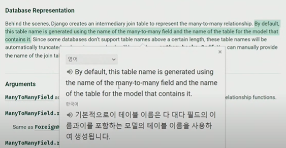
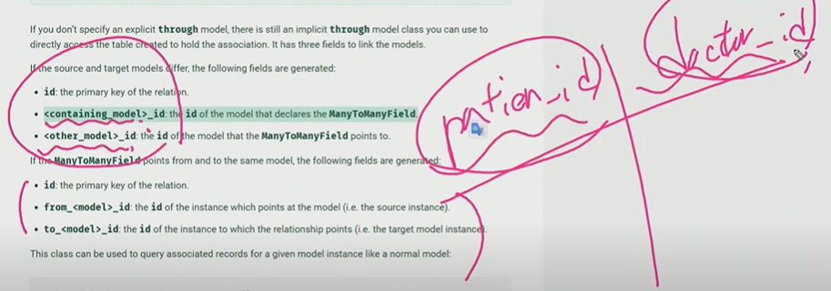

환자가 의사의 외래키를 가지고 있음

만약 patient1이 의사를 doctor 2로 바꾸고 싶다고 해도 바꿀 방법이 없음

이렇게 하는 수밖에,,

patient2가 의사를 둘 다 보고싶다고 할때

가능한 방법이 없다

외래키는 1개이기 때문에

1:N의 한계점

- 한명이 두명의 의사(두개의 외래키)를 가질 수 없음
- 원래 참조하던 의사를 다른 의사로 바꿀 수 없음

중개모델 만들기

db지우고 새로 migrate 하고 확인한 결과

hospitals_reservation이라는 새로운 중개테이블 생성

1번 환자가 1번 의사에게 진료를 받기(1번 의사가 1번 환자의 진료를 보기)

의사의 입장에서 내가 진찰해야할 예약 정보확인하기

1의 입장에서 N을 참조

필드가 없는 측에서 자신을 참조하고 있는 관계 필드를 가진 곳을 참조하는 것은 역참조

역참조에서는 '모델이름_set'이라는 모델 매니저가 생김

둘다 하나의 예약 테이블을 참고중

쿼리셋이라 반복문도 사용가능

manytomany 필드는 아무곳에나 작성해도 상관없다

그치만, 복수형으로 작성하는게 나중에 알기좋음

manytomany를 사용하니 중개모델을 따로 작성하지 않아도 자동으로 생성됨

patient1이 doctor1에 들어가고 싶다(예약하고 싶다)

patient1.doctors.add(doctor1)

doctor 입장에서는 역참조

의사가 환자를 추가하고 싶다면

의사가 1번 환자 예약 취소하기(remove)

삭제보다는 객체와의 관계를 끊는다고 이해하기

환자2가 의사와의 관계를 끊을때

이런식으로 manytomany가 중개모델없이 자동으로 실행시켜줌

하지만 그렇다고 중개모델이 필요하지 않은 것은 아님

추가적인 데이터(필드)가 필요한 경우에는 중개 모델을 작성해 주어야 함

그리고 이럴 때는 through라는 명령어가 필요해짐

즉, 외래키 2개 이외에 추가적인 데이터를 작성해야 하는 경우는 중개 테이블 필요

##### through

##### related_name

역참조시 사용할 모델 매니저의 이름을 바꾸고 싶을 때는 related_name가 필요

doctor.patient_set.all()을

doctor.patients_set.all()로 바꾸고 싶다면

이렇게 뒤에 related_name을 설정

기존의 매니저이름은 삭제됨

<매니투매니 정리>

- 두 테이블에 변화가 없다

- 1:n은 한쪽이 종속관계지만, m:n은 주어를 바꿀수도 있기때문에 완전히 속해있지 않다.
- 그래서, 모델링하기 조금 어렵다.

1:n이랑 m:n일때 기능이 달라짐

comment가 article을 참조할 때

comment가 source, article이 target

target이 source모델을 참조하는 것이 역참조

##### symmetrical

manytomany가 재귀적으로 이루어질 때 사용(자기자신을 참조)

follow같은 경우: 1이 2와 친구라면 2와 1이 친구인 것과 같음(대칭)

역참조 매니저가 생기지 않음

대칭관계 원하지 않으면 false로 설정: 그러면 1번이 2번친구에게 친구신청해도 2번이 1번을 신청하는 것은 아니게됨

장고는 중간 모델을 자동으로 만들어준다

'db_table'을 통해 원하는 대로 중간 조건 table이름 바꿀수 있다.

보통은 각 외래키의 이름_id로 만들어지지만

재귀일때는 from --_id와 to --_id로 만들어진다.

