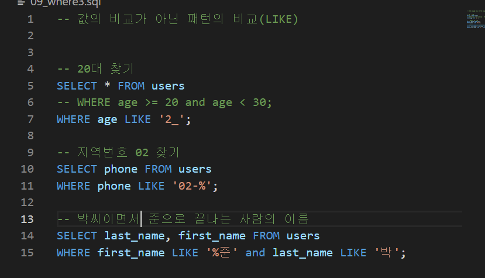
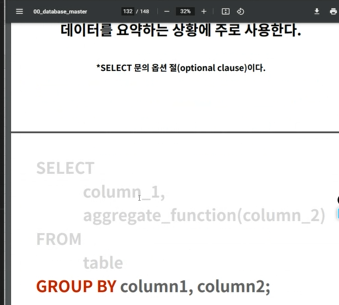

스키마: 데이터베이스 세상에서 컬럼의 틀이라고 할 수 있다

데이터베이스 이름 저장되는 법: 앱이름_모델이름 (board_comment)

데이터베이스 세상에서는 article이라고 불리지만 실제로는 article_id(데이터베이스는 자동으로 숫자로 저장된다)

sqlite 종료: ctrl z + enter

sqlite: sql문을 번역해서, 데이터베이스를 읽고 수행

sqlite3 tutorial.sqlite3(이부분 이름은 아무거나 해도됨)

examples: 테이블이름

스키마는 컬럼명+타입 정의

SELECT * FROM ~

: ~안에 모든걸 가져와라

: object.all()과 같은느낌

불러오기(.read)

테이블 삭제

추가

특정데이터 비우고 넣을거면 인자 위치 주의해서 넣기

지금 보면 2개만 쓰여있는데 왜 sql엔 3개 있냐면

insert는 추가라서 그렇다

우리가 rowid(key)를 만들지 않았지만 알아서 가지고 있다

그러나 명시적으로 우리가 pk를 만들어주는 것이 좋다(교수님피셜)

(교재 피셜 rowid를 사용하는 것이 좋다고함)

NULL 하지 않게 하려고 NOTNULL 설정

그리고 지금 이렇게 하면 PRIMARY KEY가 AUTO INCREMENT 되지 않음

*은 전부라는 뜻임

LI

LIMIT을 사용하는 현실속 사례: 게시판 HTML에서 게시글 개수같은거 한정적으로 보여줄때

1페이지는 1-10번째 글이니까 LIMIT 10 OFFSET 0

2페이지는 11-20번째 글이니까 LIMIT 10 OFFSET 10

이거를 페이지네이션이라고 부름

여태까지는 검색이 아니라 조건에 해당하는 것을 가져오는 것

나이 전부 가져오기

WHERE 조건을 만족하는 데이터 삭제

AUTOINCREMENT는 너라는 사람이 있었다 라는걸 기록하게 해줄 수 있음

set이랑 where 순서 바뀌면 안된다

이렇게 하면 table에 들어가는게 아니라 문자열로 나오기때문에

table부터 만들고 넣겠다

변수명은 소문자, 예약어는 대문자로 쓰는것이 convention이다

and도 대문자로 쓰기

소문자로 써도 실행은 됨

or로 바꾸면 둘중 하나만 해당되어도 출력됨

레코드 총 개수

평균구하기

첫번째: 나이가 어린 사람 10명 중에서 ㄱㄴㄷ 정렬

두번째: ㄱㄴㄷ 정렬 기준 10명 중에서 나이가 어린 사람 순서

