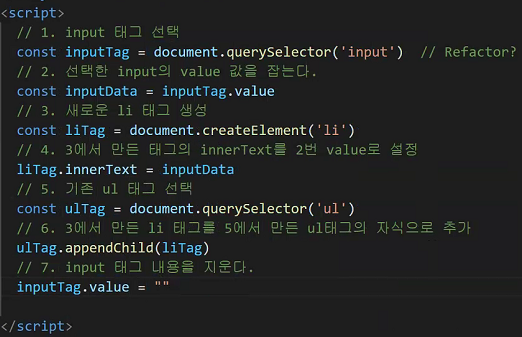
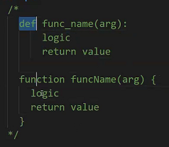
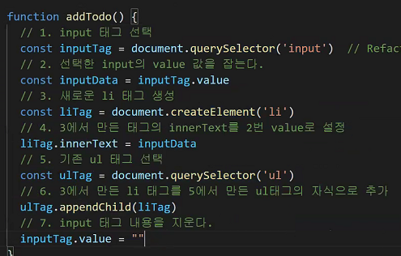
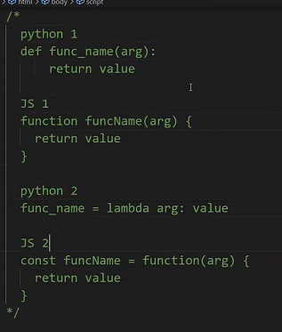
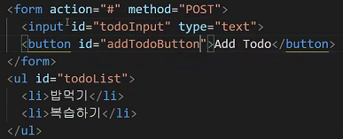
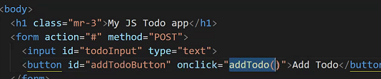
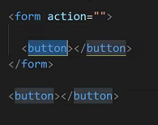
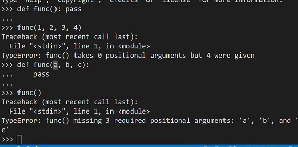
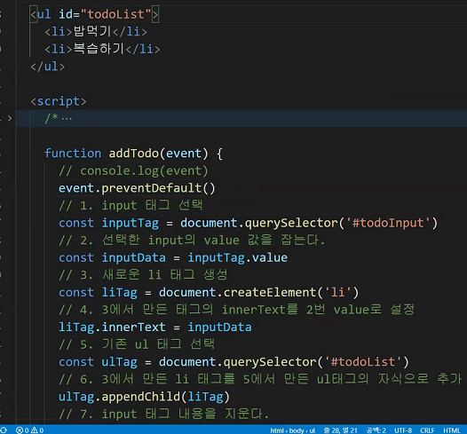
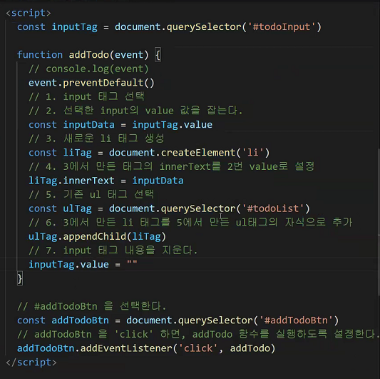

# 오전

콘솔의 시점

나의 수정은 나 혼자만의 편집일 뿐

원본 문서는 수정 x

쟝고에서 js을 사용할 수 있었던 게 파이썬이라서가 아니라 크롬이 js 기반이라 가능

##### 단일 선택

##### 복수 선택

##### 조작

`create `

`read`

`update`

`delete`

---------------

# 오후

script 태그가 body의 맨끝에 위치: 동작은 안불러지더라도 화면은 등장할 수 있음 html의 핵심이 내용이기 때문에 script 태그를 마지막에 작성하는 것이 좋다.

파이썬 def 함수와 별 차이없다

이런 흐름만 따라가자

아까 했던 것들이 반복되므로 함수화 하자

근데 아까처럼 이렇게 써있을때 새로고침 누르면

바로 html읽어서 빈 value를 넣어서 만들어버림

그래서 java는 웬만하면 줄글로 안쓰고

함수화 해서 만드는게 좋다

이렇게 대응해서 생각하자

js1을 기본으로 생각하기

css에서 id를 사용하지 않는 이유는 java스크립트에 양보하기위해

단일 선택을 위해 다 id를 설정해둔다.

onclick = addtodo() 했는데 자꾸 새로고침만 일어남

button은 form 안에 있을때만 제출

밖에 있으면 제출 x

버튼을 밑으로 내려서 해결

아니면

파이썬은 인자개수 딱딱 맞아야되는데

javascripts는 상관없음

addtodo 앱 완성

