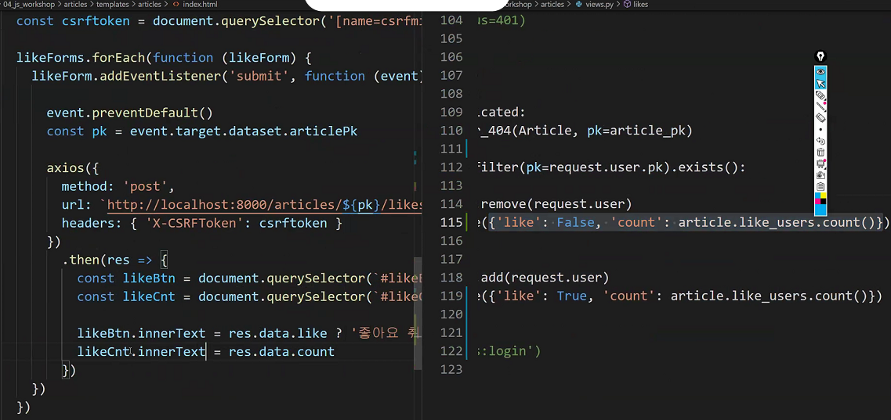

#### 기본 설정

```
python -m venv venv

pip install -r requirements.txt

.gitignore 만들기

python manage.py makemigrations

python manage.py migrate

python manage.py createsuperuser
```


##### axios

axios cdn 가져오기(github에서 가져오기)


제대로 들어갔는지 확인


##### index.html

이제 form이 필요없어진다.

why? form은 새로고침할때 필요한건데 이제 새로고침이 필요가 없어짐.


##### 


이렇게 변경


form의 id를 likeBtn과 같이 설정해두면

for문 때문에 글이 생성될때마다 좋아요버튼의 id가 likeBtn이 됨

문서당 id는 꼭 하나여야하기 때문에 class = 'likebtn'으로 설정


##### script block

base.html


index.html


이렇게 설정해두어야 axios가 범위 내에 있을 수 있다.


##### likeForms 선택


 nodelist는 유사배열이라

arrayhelpermethod가 전부 사용가능할 것 같지만

.forEach는 가능해도 .map .reduce같은 것들 전부 안됨

##### 즉, querySelectorAll은 Nodelist를 반환하고 Nodelist는 유사배열이기 때문에 .forEach만을 지원


##### 좋아요 버튼 구현

`outline`


`구현`

form <= submit

button <= click인데

form 안에 button 있으므로 submit으로 쓰기 가능


submit이라는 이벤트가 발생하면 clicked print를 실행하겠다.

근데, print가 실행됐다가 바로 사라짐


##### preventDefault()


 좋아요를 누를때마다 submit이 쌓임


##### ~번 글을 좋아합니다.


dataset을 이용하기


콘솔에는 알아서 articlePk라고 뜸


이제 모든 폼태그에 custom data가 들어감


##### csrf 토큰

이제 form이 input으로 날아가는게 아니라 csrf토큰이 전달되지 않는다는 오류가 발생


csrf token 이제 form안에 있을 필요 없음

csrf 값에 접근 할 수 있게 밖으로 빼자


토큰 실어서 보내기


이것보다 장고 공식문서에서 이렇게 하라고 하니까


headers 사용해서 csrf 전달


------------------


##### 각각의 버튼마다 pk





toggle 이용해도됨


실패하면 에러메세지 띄우기


-------------


파이썬-에스터리스크 :  해체

자바는 ... 으로 해체

