데이터 전달은 위> 아래만 가능, 아래> 위는 불가능

아래>위는 이벤트 발생 알리기


##### props


##### 예시1)

하위 컴포넌트


상위 컴포넌트에서 받아옴


상위에서 사용중


##### 단방향


##### 예시 2

app.vue에서 new component 내려보기


먼저 선언부터

부모로부터 받은 걸 내가 써볼게


명시


아까는 message:string 이렇게 썼는데

vue.js의 스타일 가이드에 따라

props를 상세히 명시하겠다.


(required:true = 내려오는 값이 무조건 있어야 된다는 뜻)


아래처럼 이렇게 하면 더 좋다


##### emit


myEvent 아니고 myevent 로 쓰는걸 권장


##### 예시

enter에 의한 이벤트만 발생

childinputchange 라고 함수이름 설정


data와 양방향 바인딩할거니까 수정


methods도 정의한다

부모가 청취할 이벤트 이름을 작성

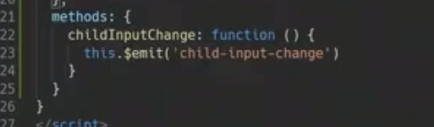


오류 발생


여태까지 vue cdn으로 정의할 때에는

데이터를 객체값으로 사용했는데

component에서는 함수값으로 사용하지 않으면 다른 메서드 들에서 다 참고해버릴 수 있어서 함수로 작성해야함

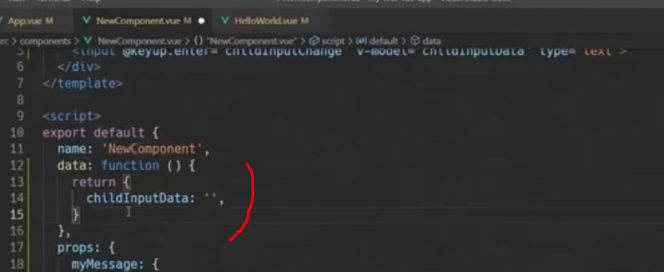

방금 오류에 대한 설명(고유 스코프를 만들어주는 이유)

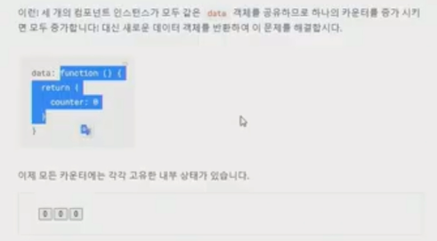


데이터도 같이 전송해주자

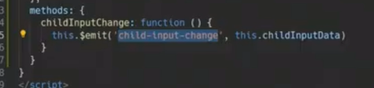

app.vue가 v-on을 이용해 청취


청취하면 이 함수를 실행하겠다

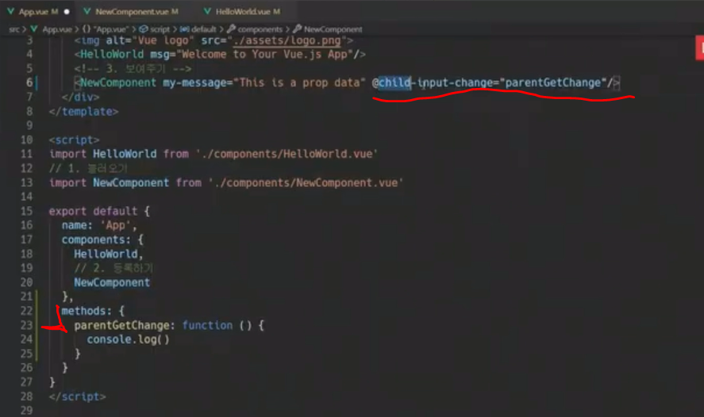


emit의 추가 인자는 리스너의 추가 인자

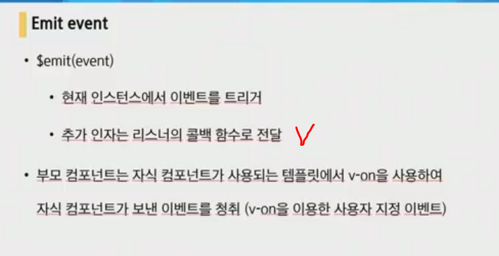


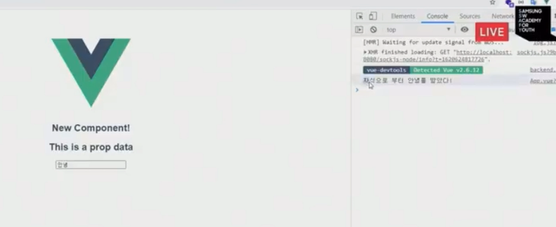


**컴포넌트의 데이터는 함수여야한다**


-----------------


##### vue router

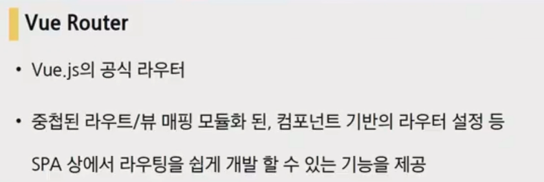

```
vue add router
```


##### 변동사항

app.vue가 변화함

style에도 작성이 생김

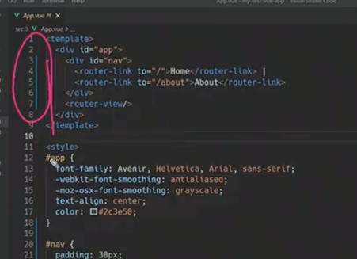

router과 views라는 폴더 등장


라우터 링크를 통해 페이지 전환은 아니지만 우리가 보는 컴포넌트가 새로 렌더링 되어 페이지 전환된 것 처럼 보임


##### vue router

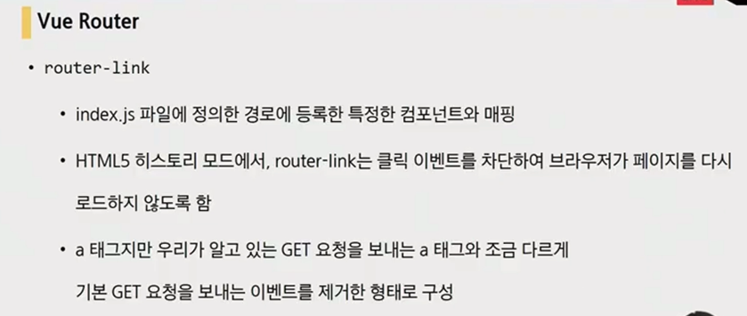


index.js는 장고의 urls.py와 유사

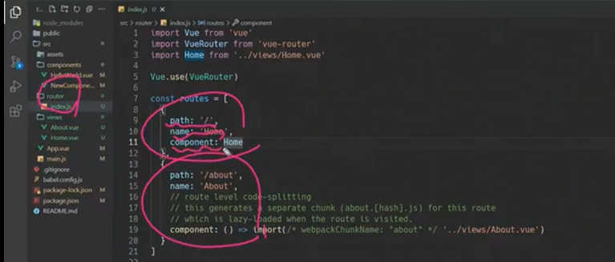


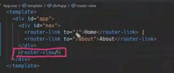

router link는 a 태그와 유사하고

router view는 어디에 렌더링을 할 것인지를 의미함


spa의 단점: url의 변화 x

이를 해결하기 위해 브라우저의 history api를 사용

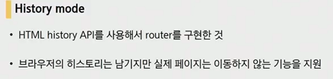

history mode 로 가능한것: 뒤로가기, 앞으로 이동


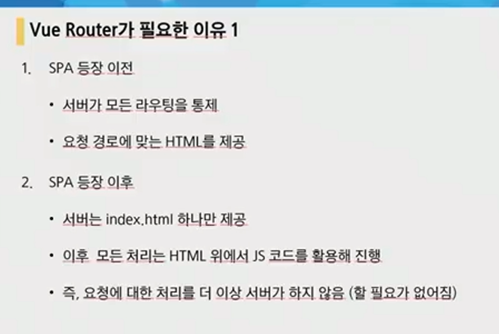

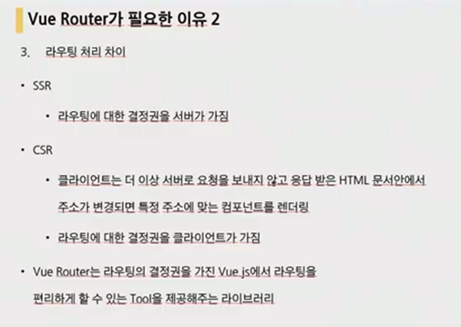

ssr: serverside rendering

csr: clientside rendering


@라는 숏컷이 제공됨

@는 src

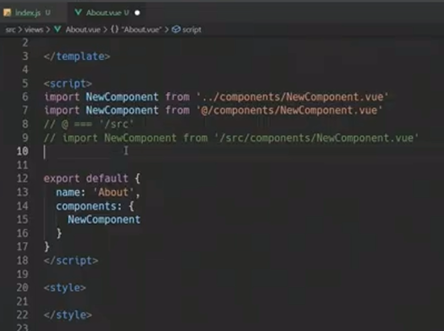

불러와서 등록 완료

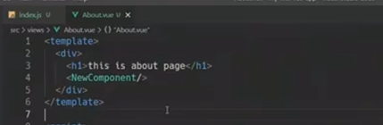

출력까지 끝


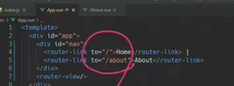

원래 이렇게 접근했는데 나중에 주소가 복잡해지면 이게 불편해질 것임

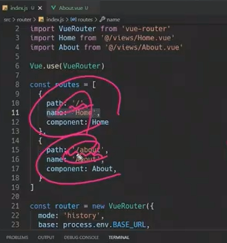

으로 장고에서 접근했던 것처럼

v binding을 통해서 이름으로 라우터를 등록 할 수 있음

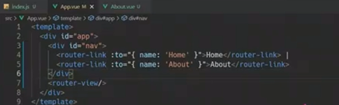


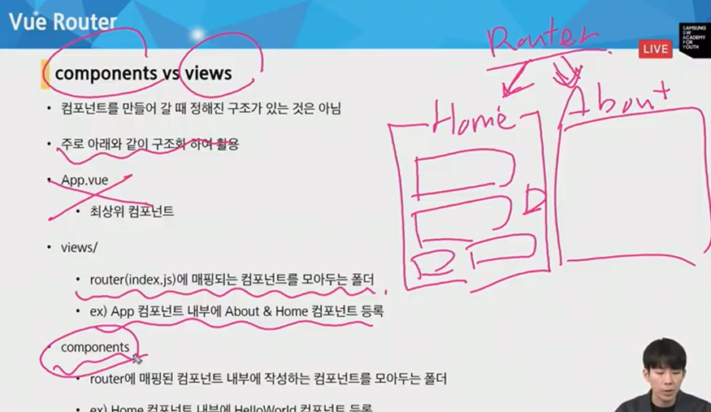

정해진 구조는 없지만 일반적인 규칙은 있음

views에는 home과 about

그외에 하위 컴포넌트들은 components에 등록


-------------

#### [LUNCH]

```
vue create 'app 이름'
cd 'app 이름'
vue add router(히스토리 모드 ㅇ)
npm run serve
```


vue의 이름 앞에 The가 붙으면 하위 컴포넌트가 없는 컴포넌트라는 뜻

Thelunch.vue를 만들고 3등분 생성

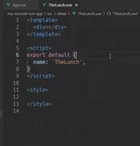


index.js에 라우터 등록

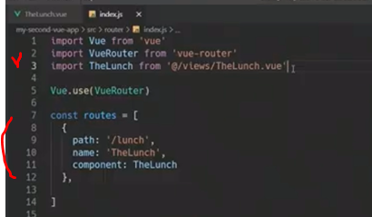


app.vue에 routerlink 등록

클릭하면 해당 컴포넌트가 렌더링 됨

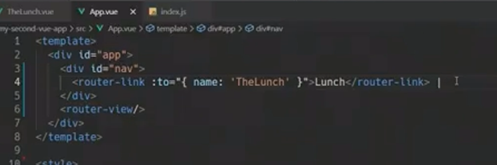


##### lodash

랜덤, 샘플용 

```
npm i --save lodash

import _ from 'lodash'
```


component 방식의 데이터는 항상 함수여야함

why? scope문제 때문에

안그러면 다같이 데이터를 공유하게 될 수가 있음

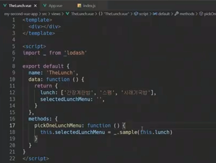


버튼을 클릭했을 때 함수 동작

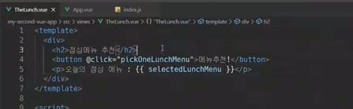


#### [LOTTO]

```
TheLotto.vue 생성
vue enter해서 기본 틀 잡기
index.js에 route 등록(import까지): mapping
App.vue에 router-link 등록
```


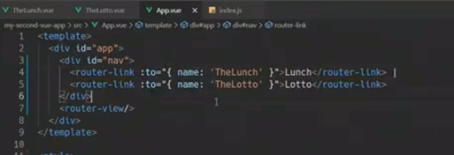


##### TheLotto.vue 채우기

이름 설정하고

데이터는 반드시 함수로

버튼을 누르면 getLottoNums

랜덤을 위해 import _ from 'lodash'

메서드에 getLottoNums 정의


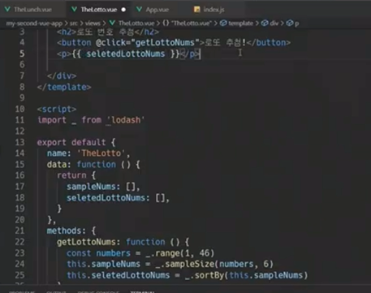


##### 동적 라우팅 해보자

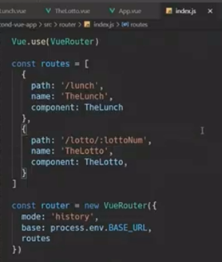

:lottoNum은 < int: lottoNum > 과 같은 기능


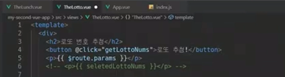


url에서 params로 값을 얻음

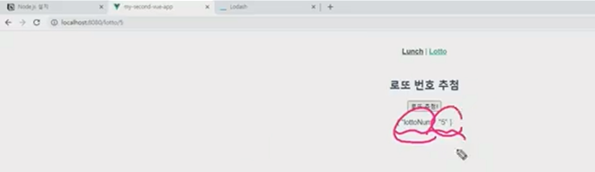

route.params.lottoNum을 하면 5를 얻을 수 있다는 뜻

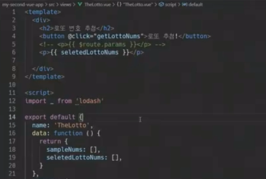

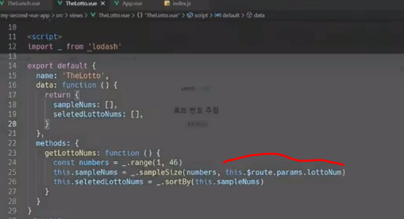


5개 추첨됨

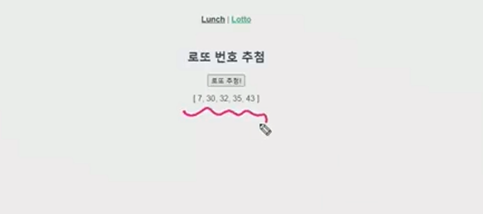