##### Vuex


전역저장소는 범위가 어떤 컴포넌트이건 접근할 수 있다는 말을 돌려말한 것 같은데 그게 중앙 집중식 저장소의 역할을 한다는 말과 이어짐


##### state


vuex에서의 상태는 data


##### 단방향


##### in vuex


화살표 방향이 중첩을 신경쓰고 있지 않음


### vuex core concept


##### 구성요소


state는 data이고 mutations에 의해 조작됨


컴포넌트가 dispatch() 메서드를 사용해서 action을 호출

컴포넌트가 상태를 직접적으로 참조하고 있지는 않음


##### actions


actions에서 말하는 data fetching 을 한다고 하지만 여기서의 데이터는 state를 말하지는 않음

권한은 있지만 state를 직접 변경하지 x

state 변경역할은 mutations(commit)


##### mutations


##### getters


##### 정리


----------------


```
vue create '이름'
cd '이름'
vue add vuex
```


##### vuex 생성했을 때


store 폴더가 생김

modules: 5번째 요소


for문 돌리기

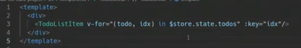

$store.state.todos를 계산된 값으로 쓸 수 있도록 computed를 사용해 단순화 하겠다.

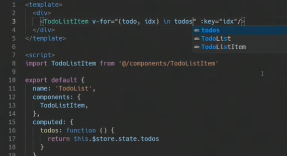


내려보낼 거니까 vind

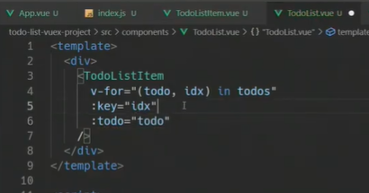


받는 쪽에서도 선언 및 사용

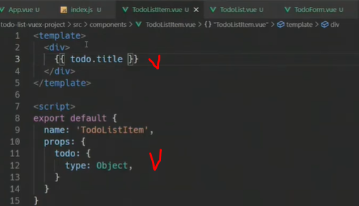


데이터와 입력을 실시간 연결(v-model)

엔터를 누르면 메서드 호출


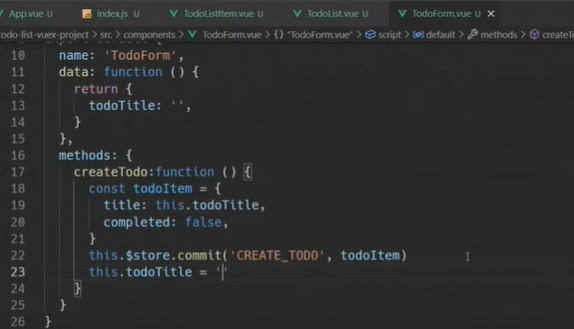


action에서 commit을 통해 mutations 호출

mutations는 첫번째 인자로 state를 받음

upper-case로 작성함(데이터를 조작하는 함수라고 확실히 알 수 있도록)

두번째 인자는 우리가 넘기고 싶은 추가적인 인자(payload)

다쓰고나서 빈 문자열로 변경


store에서는 this.$ 안해도됨

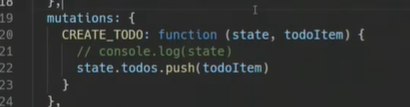


액션호출: `.dispatch(actionmethod 이름)`

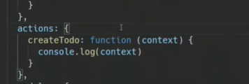

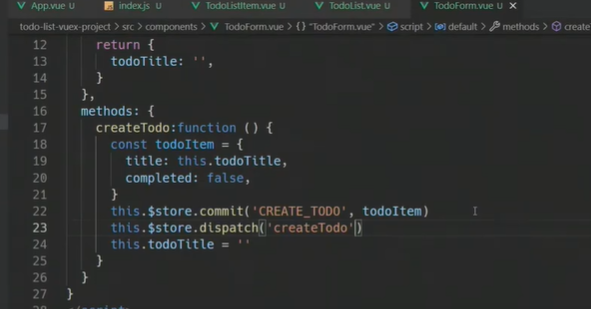


console.log(context)해봤더니

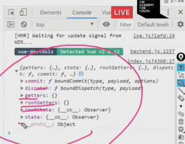


이제 뮤테이션 직접 호출할 필요없어서 삭제

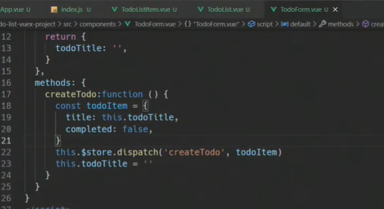


콘솔 확인해보면 context안에 commit있음

1: 뮤테이션 이름 2: 추가 인자

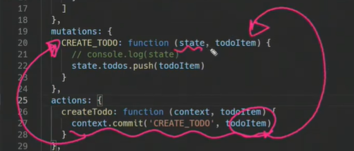


마지막으로 todoform에 trim 사용해 조건걸기

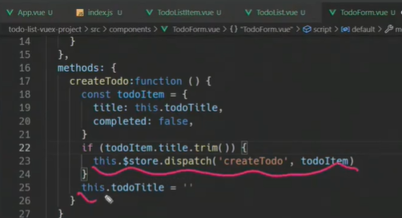


##### 사이클 정리

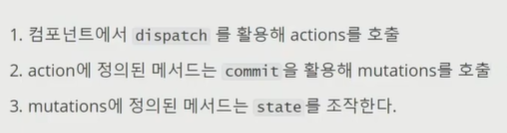


##### 디스트럭쳐링

context 대신 이렇게

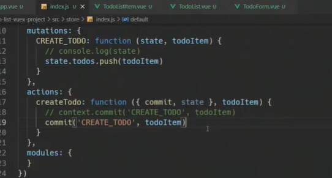


예시)

하나하나 할당해서 가져올 필요 x


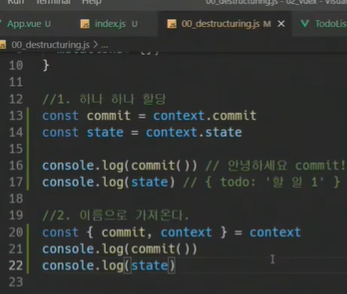

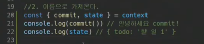