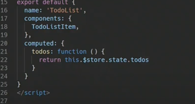
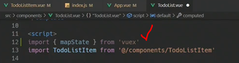
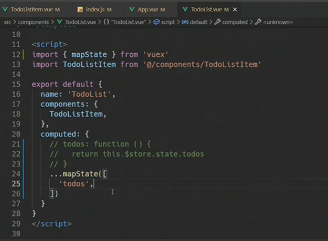
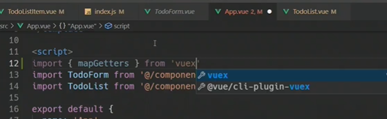
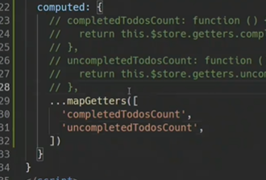
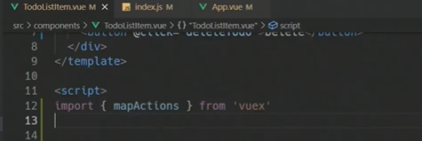
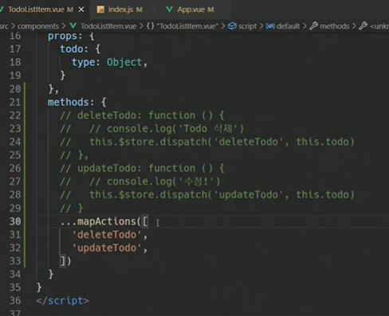
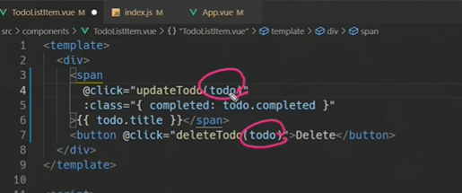
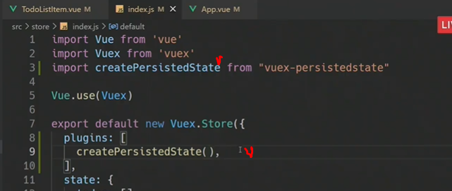

splice: 선택한 index에서 몇개의 요소를 삭제할지

(index, 1)


수정: 줄을 긋고 안긋고


action 호출


action 작성


todos는 배열임

for문을 돌면서 일치하면 반대로 아니면 그대로 두고 다시 완성된 객체가 나와야함


##### ...(spread)


예시


completed를 바꾼게 아니라

기존의 값을 불러온 후 나중에 선언한 값으로 덮어 씌워진 것


style 여기서만 쓸거니까 scoped


completed되면 선 긋기


### getters


##### getters로 만들것


getters도 mutation과 동일하게 첫번째 인자가 state

why?

상태값을 기준으로 새로운 값 계산을 해야하므로


filter를 이용해 배열의 길이 = 완료된 일 개수


computed로 getters 가져오기


완료 x 일


--------------


##### 컴포넌트 바인딩 헬퍼


##### mapstate

computed와 state를 매핑



이렇게 쓰고 있었음


메서드이기 때문에 기본적 내장은 아니고

import를 해주어야 쓸수 있다

destructuring 문법으로 import 하기






mapstate는 store의 state와 연결되어 있음

객체를 반환


##### mapgetters





객체 = {

 name : name 

}

일때 하나만 쓰는것과 같은 원리


##### mapactions




dispatch의 역할까지만 하므로



this.todo가 빠짐




값을 포함해서 넘겨주기


`이처럼 바인딩헬퍼로 축약해서 사용가능`


-------

브라우저의 로컬스토리지에 저장하기(원래는 쿠키나 세션 이런거 저장되는 곳)

이를 가능하게 하기 위해 플러그인 설치하기

```
npm install --save vuex-persistedstate
```


장고에서 app 설치하고 등록했던 것처럼

플러그인 등록해야함(import 하고 등록)




이제 새로고침해도 데이터가 사라지지 않음

브라우저의 로컬스토리지를 빌리고 있기 때문

f12눌러서 로컬르토리지 확인하면 vuex안에 데이터 들어있음