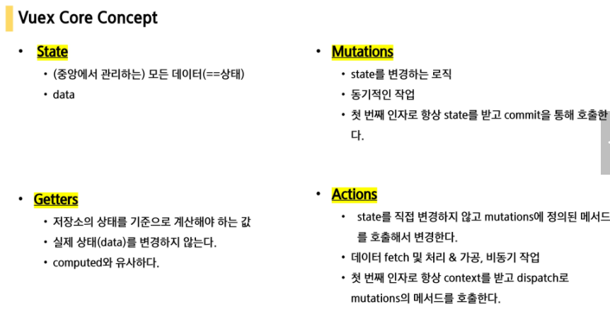

# VUE

### 1) Vue.js Intro

##### 1. Front-end

HTML, CSS, JavaScript를 활용해 데이터를 볼 수 있게 함

client가 데이터와 상호작용 할 수 있음

대표적인 front-end 프레임워크: Vue.js, React, Angular


##### 2. Vue.js

사용자 인터페이스를 위한 프로그레시브 프레임워크

현대적 tool과 다양한 라이브러리를 통해 `SPA` 완벽 지원


##### 3. SPA

SPA: Single Page Application : 단일 페이지 어플리케이션

- 현재 페이지를 동적으로 작성해 사용자와 소통하는 웹 어플리케이션

- 단일 페이지로 구성: 한개의 웹페이지에서 여러 동작이 이루어지며 모바일 앱과 비슷한 형태의 사용자 경험 제공
- 처음에만 페이지를 받아오고 이후에는 동적으로 DOM 구성
- 연속되는 페이지 간 사용자 경험(UX) 향상
- 동작 원리 일부가 CSR 구조를 따름
  - `CSR`
    - CSR: Client Side Rendering
    - SPA가 사용하는 렌더링 방식
    - 최초 요청시 서버에서 빈 문서를 응답 → 클라이언트에서 데이터를 요청 → DOM을 렌더링
    - 사용자의 브라우저가 일하는 방식이기 때문에 기업 입장에서는 비용 절감 효과
    - SSR보다 초기 전송 페이지 속도는 빠르지만, 필요한 데이터는 클라이언트에게 추가 요청받아 재구성해야 하므로 전체적인 페이지 완료 시점은 SSR보다 느림
  - `CSR의 장점`
    - 서버와 클라이언트 간 트래픽 감소
    - 사용자 경험 향상: 전체 페이지 렌더링 X, 변경 부분만 갱신
  - `CSR의 단점`
    - SEO(검색엔진 최적화) 문제 발생 가능


--------

### 2) Vue.js 의 Concepts

##### 1. MVVM Pattern

애플리케이션 로직을 UI로부터 분리하기 위해 설계

구성요소 : `Model` , `View` , `View Model`

`ViewModel`을 활용해 `Data`를 얼마만큼 잘 처리해서 보여줄 것인지(`DOM`)

- **Model**

  JavaScript의 Object 자료 구조

  Object: Vue instance 내부에서 data로 사용

- **View**

  DOM(HTML)

  Data의 변화에 따라 바뀜

- **ViewModel**

  모던 Vue Instance

  View와 Model 사이에서 Data와 DOM에 관련된 모든 일을 처리


##### 2. 코드 작성 순서

Data 변화 → DOM 변경(반응형, reactive)

1. Data 로직 작성
2. DOM 작성


-------

### 3) Vue.js 의 Basic syntax

##### 1. Vue instance

Vue instance === Vue Component

Options 객체를 전달하며 생성 → 여러 Options를 사용해 원하는 동작 구현


##### 2. el

Vue 인스턴스에 연결할 DOM 엘리먼트 필요(연결 템플릿 필요)

CSS 선택자 문자열 혹은 HTMLElement로 작성

```vue
<div id="app">
    <button>click</button>
</div>


<script>
const app = new Vue({
	el: '#app'
})
</script>
```


##### 3. data

Vue 인스턴스의 데이터 객체

Vue의 template에서 interpolation(예: {{ message }})을 통해 접근 가능

디렉티브(v-bind, v-on)에서도 사용 가능

Vue 객체 내 다른 함수에서 this 키워드를 통해 접근 가능

화살표 함수 사용 X

```vue
<script>
const app = new Vue({
	el: '#app'
    data : {
    	message: 'Hello',
}
})
</script>
```


`주의할 점 1`

```vue
<p>{{ data.message }}</p>
```


위와 같이 사용하지 X

Vue는 data를 들고 있는게 아니라 message를 들고 있음


`주의할 점 2`

```vue
data: {
	lastName: 'Park',
	firsName: 'Nayoung',
	fullName: this.lastName + this.firstName
}
```

위와 같이 data  내부에서는 this를 사용하지 X


##### 4. methods

Vue 인스턴스에 추가할 메서드

Vue의 template에서 interpolation(예: {{ message }})을 통해 접근 가능

Vue 객체 내 다른 함수에서 this 키워드를 통해 접근 가능

화살표 함수 사용 X

```vue
<script>
const app = new Vue({
	el: '#app'
    data: {
    	message: 'Hello',
	}
    methods: {
    	greeting: function () {
    		console.log('hello')
		}      
    }
})
</script>
```


##### 5. this

this는 Vue 함수 객체 내에서 vue 인스턴스를 가리킴


`주의할 점 `

```vue
<script>
const app = new Vue({
	el: '#app'
    data: {
    	message: 'Hello',
	}
    methods: {
    	Func1: function () {
    		console.log(this)		// Vue instance
		},
        Func2: () => {
    		console.log(this)		// window
		},    
    }
})
</script>
```

첫번째 this는 인스턴스인 app을 가르키고

두번째 this는 상위에 바인딩 되어 window를 가리킨다.


위와 같은 이유 때문에

methods 정의에서는 arrowfunction을 사용하지 않는다.

즉, 화살표 함수를 사용하면 안되는 경우: `data`, `method 정의`


------------

### 4) Template Syntax

#### [1] Directive(디렉티브)

v- 접두사가 있는 특수 속성

표현식의 값이 변경될 때 reactive하게 DOM에 적용하는 역할

- 전달인자: `:`

  ```vue
  <a v-on:click="doSomething">...</a></a>
  ```

- 수식어: `.`

  ```vue
  <form v-on:submit.prevent="onSubmit">...</form>
  ```


##### 1. v-text

엘리먼트의 textContent 업데이트

interpolation 문법 → v-text로 컴파일

자바스크립트의 node.innerText와 같은 역할

```vue
<p v-text="message"></p>
```

```vue
<p>{{ message }}</p>
```

위 두개는 동일


##### 2. v-html

엘리먼트의 innerHTML 업데이트


`주의할 점`

```vue
<script>
const app = new Vue({
	el: '#app'
    data : {
    	message: 'Hello',
    	tag: '<h1>hi</h1>'
}
})
</script>
```

```vue
<div v-html="tag"></div>	//1
<div>{{ tag }}</div>	//2
```


결과값

```vue
hi		// 1
<h1>hi</h1>		//2
```


##### 3. v-show

조건부 렌더링 中 하나

엘리먼트에 CSS 속성 토글

```vue
<p v-show="true"></p>	// 보임
<p v-show="false"></p>	// 안보임
```

실제로 렌더링은 되지만 눈에서 보이지 않는 것이므로 적은 횟수로 렌더링 되는 경우라면 v-if에 비해 렌더링 비용이 높다 but 자주 변경되는 요소일 경우 한번 렌더링 된 이후부터 보여주는 지에 대한 여부만 판단하면 되므로 토글 비용 적음


##### 4. v-if, v-else-if, v-else

조건부 렌더링 中 하나

디렉티브의 표현식이 true일때 블록을 렌더링

toggle 기능을 사용한다고 했을 때 화면에서 보이지 않을 뿐만 아니라 렌더링 자체가 되지 않기 때문에 렌더링 비용이 낮음 but 자주 변경되는 요소의 경우 재렌더링 해야하므로 비용 증가 가능


##### 5.  v-for

원본 데이터를 기반으로 엘리먼트 or 템플릿 블록 여러번 렌더링

item in items 구문 사용

v-if와 가능하면 동시에 사용하지 않을 것

반드시 key 속성을 각 요소에 작성

```vue
<ul>
  <li
    v-for="todo in todos"
    :key="todo.id"				// key 속성
  >
    {{ todo.text }}
  </li>
</ul>
```


##### 6. v-on

엘리먼트에 이벤트 리스너 연결

전달인자(arguments)로 표시 `:`

약어: `@` (**v-on:click** === **@click** )


##### 7. v-bind

HTML 요소의 속성에 Vue의 상태 데이터(state)를 값으로 할당

약어: `:`(**v-bind:href** === **href**)


예시)


##### 8. v-model

HTML form 요소의 값과 data를 양방향 바인딩

form의 input과 textarea 엘리먼트에 양방향 데이터 바인딩

(input과만 사용한다)


```vue
// input 과 data
<h2>{{ age }}살</h2>
<input v-model="age" type="text">
```

age 입력하면 바로바로 화면에 동기화 됨


```vue
// checkbox

<input type="checkbox" id="checkbox" v-model="checked">
<label for="checkbox">{{ checked }}</label>

... 생략 ...
data:{
	checked: true
}
```


##### 9. computed

데이터 기반의 계산된 속성

특정 데이터를 연산하고 싶을 때 사용

있는 그대로의 data보다 연산한 data를 가져오고 싶을 때

반드시 반환 값이 있어야함

선언형 프로그래밍(특정 값이 변동하면 새로 계산해 보여준다)


`주의` computed 와 method `주의`

method가 조금 더 포괄적인 느낌

 최종 결과에 대해 두 가지 접근 방식은 서로 동일

차이점은 computed 속성은 종속 대상을 따라 저장(캐싱) 됨

computed는 종속된 대상이 변경되지 않는 한 computed에 작성된 함수를 여러 번 호출해도 계산을 다시 하지 않고 계산되어 있던 결과를 반환

methods를 호출하면 렌더링을 다시 할 때마다 항상 함수를 실행


즉, **computed**는 **캐싱**, **method**는 **함수**

캐싱은 정보를 참조, 함수는 실행이므로

computed가 메모리적으로는 손해일 수 있지만 시간적으로는 이득(효율적)


##### 10. watch

데이터에 변화가 일어날 때 실행

명령형 프로그래밍(데이터가 바뀌면 함수 실행!)

```vue
<button @click="num+=1"></button>

<script>
const app = new Vue({
	data: {
		num:2,
	}
	watch:{
		num: function () {
			console.log(`${this.num}이 변경`)
		}
	}
})
</script>
```


##### 11. filters

interpolation 혹은 v-bind 이용시 사용 가능

마지막에 `|` 와 함께

체이닝 가능


#### [2] Lifecycle Hooks

각 Vue 인스턴스는 생성될 때 일련의 초기화 단계를 거침

공식문서 참고


#### [3] lodash

JavaScript 유틸리티 라이브러리

array, object등 자료구조를 다룰 때 사용들을 제공 

reverse, sortBy, range, random 등

(lotto 필기 부분 참고)


----

### 5) SFC

##### 1. Component

기본 HTML 엘리먼트 확장해 재사용 가능한 코드를 캡슐화하는 데 기여

유지보수와 재사용성 측면에 있어서 강력한 기능 제공

Vue 컴포넌트 === Vue 인스턴스


##### 2. SFC

하나의 컴포넌트는 .vue라는 하나의 파일 안에서 작성됨

HTML, CSS, JavaScript 코드를 하나의 파일(.vue)에서 관리

즉, Vue 컴포넌트 === Vue 인스턴스 === .vue 파일


### 6) Vue CLI

##### 1. Vue CLI 설치

```
npm install -g @vue/cli		# vue-cli 설치
vue create 'app 이름'        # 프로젝트 생성
npm run serve				# 서버 실행
```


##### 2. Vue CLI 구조

- src/assets: webpack에 의해 빌드된 정적 파일
- src/components: 하위 컴포넌트 위치
- src/App.vue: 최상위 컴포넌트
- src/main.js: Vue 전역에서 활용할 모듈 등록
- babel.config.js
- package.json
- package-lock.json


### 7) Pass Props 와 Emit Events

부모 → 자식: 데이터 전달(Pass props), 아래로

자식 → 부모: 부모에게 알림(Emit events), 위로


부모는 props를 통해 자식에게 데이터를 전달하고,

자식은 events를 통해 부모에게 메세지를 보냄


##### 1. Props

상위 컴포넌트 정보를 전달하기 위함

하위 컴포넌트에서 props 옵션을 사용해, 수신하는 props를 명시적으로 선언해야함

하위 컴포넌트에서 상위 데이터를 직접 참조할 수 X

props의 이름 컨벤션: kebab-case(HTML), camelCase(script)


사용예시)

```vue
// App.vue (부모 컴포넌트)
<template>
	<NewComponent my-message="a prop data"/>
</template>
```

```vue
// Newcomponent.vue (자식 컴포넌트)
<template>
	<div>
    	<h2>{{ myMessage }}</h2>	//props 사용
    </div>
</template>

<script>
export default {
    name: 'NewComponent',
    props: {						//props 명시
        myMessage: {
        	type: String,
            required: True,
        }		
    }
}
</script>
```


##### 2. Emit event

부모 컴포넌트는 v-on(`@`)을 사용해 자식 컴포넌트가 보낸 이벤트 청취

이벤트 이름 kebab-case 권장


`$emit(event)`

- event가 트리거
- 추가 인자: 리스너의 콜백 함수


사용예시)

```vue
// Newcomponent.vue (자식 컴포넌트)
<template>
	<div>
        <input @keyup.enter="childInputChange" v-model="childInputData" type="text">
    </div>
</template>

<script>
export default {
    name: 'NewComponent',
    // data는 함수로 정의한다(scope 문제 때문에)
    data: function () {
        return {
            childInputData: '',
    	},
	},
    methods: {
        childInputChange: function() {
            // $emit('emit할 이벤트 이름', 같이 보낼 data)
            this.$emit('child-input-change', this.childInputData)
        }
    }  
</script>
```

```vue
// App.vue (부모 컴포넌트)
<template>
	// child-input-change를 청취하면 parentGetChange 메서드를 실행
	<NewComponent @child-input-change="parentGetChange"/>
</template>
```


##### 3. 단방향 데이터 흐름

props는 언제나 부모 >  자식

자식 요소가 의도치 않게 부모 요소 상태를 변경함으로써 앱의 데이터 흐름을 이해하기 어렵게 만드는 일을 방지


### 8) Vue Router

```
vue add router
```

App.vue에 router 부분이 생기고 views라는 폴더가 생성된다.

index.js는 django의 urls.py와 유사한 기능을 한다.


##### 1. router-link

index.js 에 정의한 경로대로 특정 컴포넌트와 매핑

history mode에서 클릭 이벤트를 차단해 페이지 다시 로드를 막음

a태그 이지만 GET 요청 이벤트가 제거된 형태

즉, 라우터 링크를 통해 페이지 전환은 아니지만 우리가 보는 컴포넌트가 새로 렌더링 되어 페이지 전환 효과를 줌


##### 2. router-view

실제 component가 DOM에 부착되어 보이는 자리

router-link를 클릭하면 index.js에 정의한 컴포넌트와 연결


##### 3. history mode

HTML history API를 사용해 router를 구현 한 것

히스토리는 남기지만 실제 페이지는 이동하지 X


SPA의 단점이 URL의 변화가 없다는 점인데 history mode를 이용해 이를 해결 할 수 있음

뒤로가기, 앞으로 가기 등과 같은 기능이 가능한 이유!


##### 4. how to use ROUTER

```vue
// index.js

Vue.use(VueRouter)

const routes = [
	{
		path: '/about',
		name: 'About',
		component: About,
	},
]
```

```vue
// App.vue
<template>
	<div id="app">
    	<div id="nav">
           <router-link :to="{ name: 'About' }"></router-link>
    	</div>
        <router-view/>
    </div>
</template>
```


### 9) Vuex

#### [1] Vuex 란

Vue.js 애플리케이션에 대한 `상태 관리 패턴` + `라이브러리`

모든 컴포넌트에 대한 중앙 집중식 저장소 역할

state가 예측 가능한 방식으로만 변경될 수 있도록 보장

각 컴포넌트에서는 중앙 집중 저장소의 state만 신경쓰면 됨

규모가 큰(컴포넌트 중첩이 깊은) 프로젝트에 편리


#### [2] Vuex Core Concept



##### 1. STATE

중앙에서 관리하는 모든 상태 정보(`data`)

`mutations`에 정의된 메서드에 의해 변경

state는 오로지 mutations 메서드에 의해 조작됨


##### 2. ACTIONS

`dispatch()` 메서드에 의해 호출

data fetching 등의 작업을 수행

항상 `context`가 인자로 넘어옴


##### 3. MUTATIONS

`commit()` 메서드에 의해 호출

동기적인 코드만 작성(비동기적으로 동작하면 state 변화 시점 달라질 수 있기 때문)

첫번째 인자로 `state`가 넘어옴


##### 4. GETTERS

state를 변경하지 않고 활용하여 계산 수행

computed와 유사

첫번째 인자로 `state` 사용(state를 기준으로 계산해야 하므로)


##### 5.  총정리 및 예시

- 동작 순서

  `COMPONENTS` → dispatch → `ACTIONS` → commit → `MUTATIONS` → `STATE`


- 1] component에서 시작

  2] context를 받아 dispatch를 통해 action 호출

  3] commit를 통해 mutation 호출

  4] mutation에 의해 state 변경


#### [3] 컴포넌트 바인딩 헬퍼

`mapState`, `mapGetter`, `mapAction`, `mapMutations`

```vue
import { mapState(컴포넌트 바인딩 헬퍼 명) } from 'vuex'
```


##### 1. mapState

computed와 state를 매핑(store의 state와 연결되어있다)

객체를 반환


예시) 원래 코드

```vue
<script>
export default {
    // 생략 //
    computed: {
        todos: function () {
            return this.$store.state.todos
        }
    }
}
</script>
```

computed를 이용해 store의 state에 있는 todos를 가져옴


예시) mapState 사용 코드

```vue
import { mapState } from 'vuex'

<script>
export default {
    // 생략 //
    computed: {
		...mapState([
            'todos',
        ])
    }
}
</script>
```


##### 2.mapGetters

getter의 평가된 값을 반환하는 컴포넌트 계산 옵션을 만듦


예시) 원래 코드

```vue
<script>
export default {
    // 생략 //
    computed: {
		completedTodosCount: function() {
            return this.$store.getters.completedTodosCount
        },
        uncompletedTodosCount: function() {
            return this.$store.getters.uncompletedTodosCount
        },
    }
}
</script>
```


예시) mapGetters 사용 코드

```vue
import { mapGetters } from 'vuex'

<script>
export default {
    // 생략 //
    computed: {
		...mapGetters([
            'completedTodosCount',
            'uncompletedTodosCount',
        ])
    }
}
</script>
```


##### 3. mapActions

액션을 전달하는 컴포넌트 메서드 옵션을 만듦

dispatch의 역할까지만


예시) 원래 코드

```vue
<script>
export default {
    // 생략 //
    methods: {
		deleteTodo: function () {
            this.$store.dispatch('deleteTodo', this.todo)
        }
    }
}
</script>
```


예시) mapActions 사용 코드

```vue
import { mapActions } from 'vuex'

<script>
export default {
    // 생략 //
    computed: {
		...mapActions([
            'deleteTodo',  // 추가 인자는 template에서 넘기기
        ])
    }
}
</script>
```

