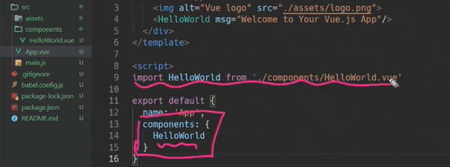
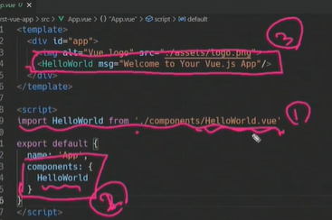
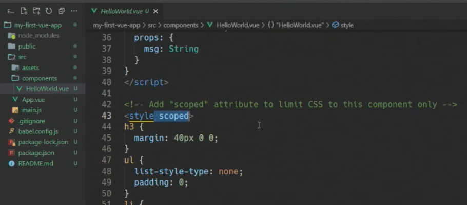
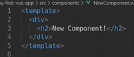
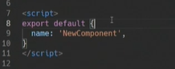
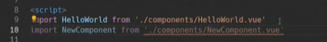
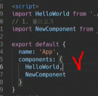
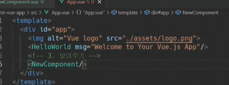

##### SFC

const app = new  Vue()

이렇게 했을 때 app이 component

##### 구조

쪼개면 쪼갤수록 유지 보수에 용이

상하관계가 있음(큰 네모 안에 작은 네모 여러개)

##### SFC

하나의 파일(vue)이 하나의 컴포넌트

##### Vue CLI

command line, 명령어

##### Node.js

Vue cli를 사용하려면 node.js를 설치해야함

자바는 브라우저 안에서만 동작한다는 한계가 있었음

노드js가 탄생하면서 serversiderendering이 가능해지고 지금같은 인기를 갖게된 계기

##### Vue CLI 설치

##### 설치

vue 3이 릴리즈 되긴 했지만 vue 2로 설치

##### Babel

##### Webpack

const는 재할당, 재선언이 불가능하므로 오류 발생

src:webpack에 빌드되는 정적 파일들

components: 하위 컴포넌트가 들어감

app.vue: 최상위 컴포넌트

main.js: webpack이 빌드를 시작할때 가장 먼저 불러오는 시작점, 뷰의 전역에서 사용하는 모듈들을 등록

gitignore은 기본적으로 만들어줌

gitinit을 안했는데 자동으로 master가 생김(git 초기화가 저절로 생김)

package.json: requirements.txt와 비슷한 역할, 우리가 건들일 x

package-lock.json: 팀원들과 동일한 환경(종속성)을 유지하기 위한 파일, 우리가 건들일 x

##### app.vue

template(html) - script(js) - style(css)

.vue가 하나의 컴포넌트

app.vue와 하위 컴포넌트의 연결 확인

불러와서 - 등록하고 - 사용

style scope 뜻

이 스타일은 딱 이 .vue에서 한정되게 동작한다는 뜻

--------

##### component 만들기

new component 만듦

vue 하고 엔터하면 3등분 자동완성

template 안에는 하나의 최상위 태그가 있다

app 이름과 동일하게 name 설정

꼭 그럴 필요는 없지만 그러지 않을 이유도 없음

1. 불러오기

2. 등록하기

   

3. 사용하기(닫는 태그 작성)

   