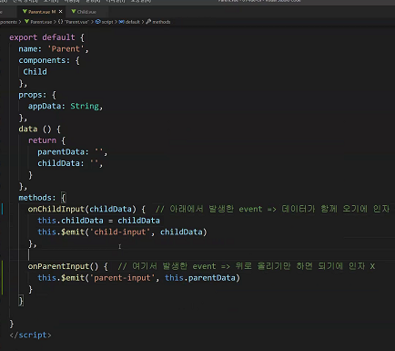
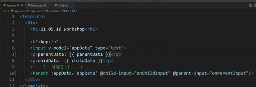

이렇게 구성하기


app.vue, helloworld.vue 지우기


app이 최상위 컴포넌트라서 main과 같은 자리에 둘 것이다.


src로 들어옴

touch App.vue

꼭 이 자리에 있을 필요는 없긴함


app.vue에서 해야할 일은

프레임워크이므로 틀에 박힌 일

꼭해야할 일이 3가지 있음


뒤의 { } 는 block이 아니라 object


템플릿에는 딱 하나만 들어갈 수 있음

div가 있으면 그 안에다가 넣을 수 있는 것


여기까지의 작업은 생각을 안하고 하는 작업


parent.vue와 child.vue에 같은 작업반복

vue치고 엔터누르면 자동으로 틀 생성


여기까지가 component를 기획하는 단계(각각을 컴포넌트화) 

이걸 하고나야 데이터 모델링할수 있음


1.불러서


parent는 그냥 변수값같은것(as)

p라고 써도 됨


2.등록


key는 템플릿에서 사용할 이름

value는 위에서 가져온 것

근데 웬만하면 같은거로 쓰면 좋으니까


3.사용


동일한 작업 해주기


App은 data 필요

data는 함수

return은 appData


input과 appData를 양방향 바인딩하기 위해서는 v-model


check


데이터를 내려줘야함

내려주기 위해서는 props가 필요


parent는 app데이터를 내려받아야하니까

내가 부모한테 상속받을게 있는데 그게 string이야


:appData

속성값을 보낸다는 뜻


Child도 똑같이 할거임


reactive하게 반응하는지 확인

 f12 콘솔 vue로


나머지 작업 해주자


여기까지가 데이터를 내리는 과정

근데 올리는건 약간 어려움

이벤트(시그널)이 있어야함


child에서는 parent한테 직접적으로 무언갈 할수 없으니

살려달라고 소리를 지르자(시그널을 던지자 = 이벤트를 발생시키자)


@input으로 엮어주자(change는 엔터칠때 input은 칠때마다)


this는 뷰 인스턴스> child 컴포넌트 전체

emit: 방출하다

```
this.$emit('childInput', '으악')

차일드가.방출합니다(key(이름), value)
```


Parent도 들을 준비를 해야지


함수의 인자는 event로 하려고 했는데

그건 event 전체의 결과가 오는거니까


parent도 app에 소리쳐야하므로

data로 승격시켜야함


방출


이름 겹치긴 하는데 상관없음


app에 child를 듣는 작업해주자








아래 메소드 설정도 하기