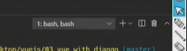
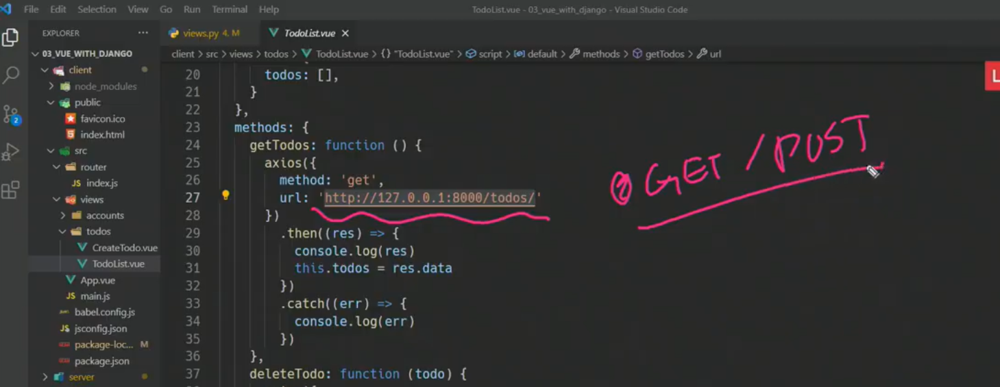
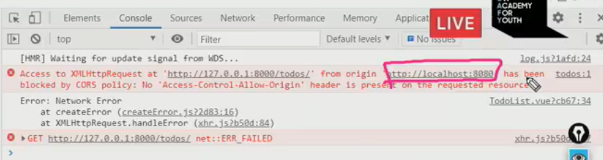
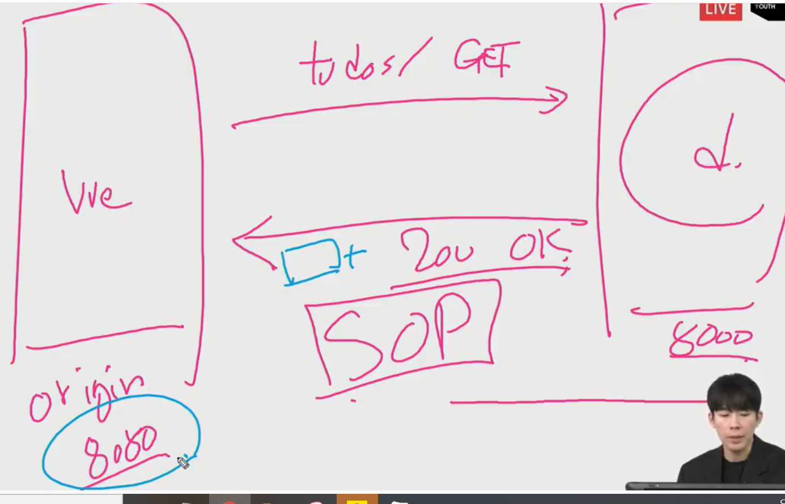
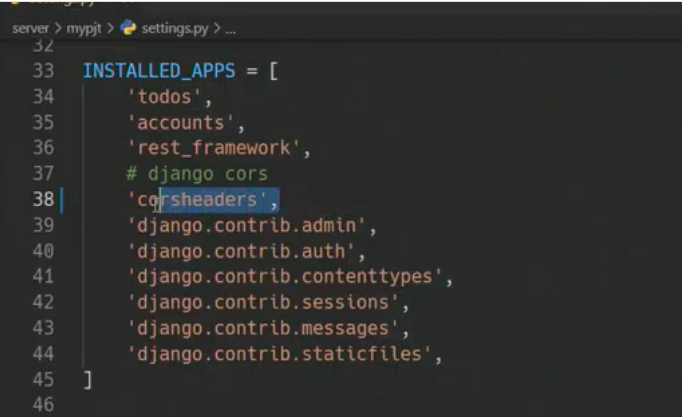
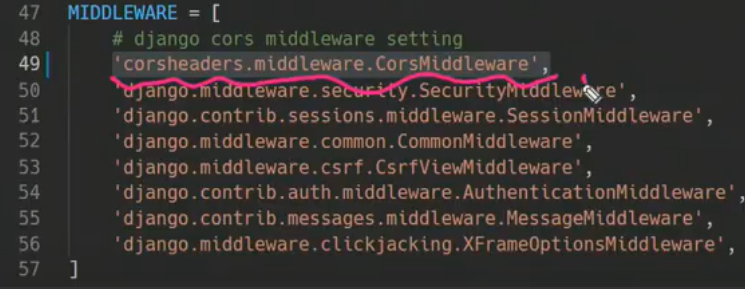
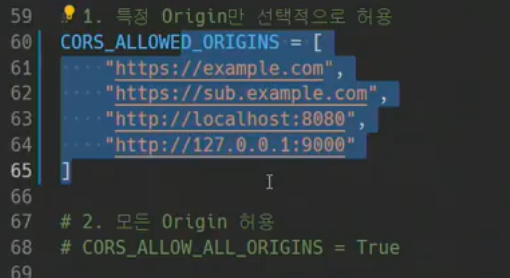

서버에 요청을 잘 보낼 수 있도록 인자값을 잘 보내는 것도 클라이언트의 역할 중 하나


cors와 반대되는 sop


출처

파일의 경로만 다르면 성공

3. https
4. 81

5. 호스트 다름


반대되는 개념인 cors


즉 응답에 cors hearder라는 것이 추가되는 것(서버에 붙어서 옴)


서버에서 코스헤더를 보내는거니까 서버에서 지정


코스헤더가 없다면 서버는 응답해도 브라우저에서 차단할 수 있음


어떤 출처에 대해 허용을 할 것인가(origin)


origin 응답헤더


모든도메인에서 포트접근


`*`가 왔다는 것은 다른 오리진에서 보냈어도 응답데이터를 받을 수 있다는 뜻


예시

요청: 


응답: 

> 요청 보낸 곳에서만 응답 받을 수 있다는 뜻


sop는 port랑 호스트랑 프로토콜이 같아야됨

vue는 로컬호스트 8080

장고는 로컬호스트 8000

둘이 포트가 다르므로 브라우저에서 vue를 차단

그러므로 응답에 cors header를 붙여줘야함


코드작성

```
1. client와 server 중에 고르기
2. server 들어가서 
python -m venv venv
source venv/script/activate
pip install -r requirements.txt
python manage.py migrate
```




가운데 눌러서 split


client에

npm install


vue에서



장고쪽으로 get 요청을 보내고 있음



오류발생


서버는 응답을 잘 보냈는데

sop 정책에 걸려서 브라우저가 코스헤더없다고 막음



코스 붙여서 보내줘야함


해결하기 위해




미들웨어 처리순서도 중요







created를 통해 뷰인스턴스가 생길때

알아서 함수 실행되게 하여 목록 보여주도록 함