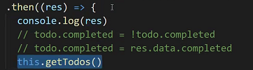

서버와 클라이언트의 깃 관리

배포되어야하는 대상이 다르기 때문에 따로 관리해야함

깃이 배포의 기능도 있기 때문에 두개를 같이 저장하면 문제가 발생

오른쪽에

makemigrations랑 migrate

create todo에 hi를 입력했더니 오류 등장

get 요청이 계속 가고있는데 왜 오류?

서버가 설정한 결과를 못받아보고있다는 뜻

요청의 근원은 8080

host는 8000

이처럼 둘이 다를경우

strict하게 보겠다

response header: 택배 송장과 유사

settings.py installed_apps에서

corshearders 확인(cors관련, 설치도 됐는지 확인)

middleware에도 있는지 확인

middleware: 모든 요청과 응답의 가운데에 있음

맨위에 두어야함

개발일때 배포일때

1. 나 제대로넘겼어 응답은 신경쓰지 않을거야 클라이언트의 판단만 신경쓸래
2. 무조건 서버에서 온 데이터 응답대로 할거야
3. 전체 투두 받아와서 데이터 갱신할거야