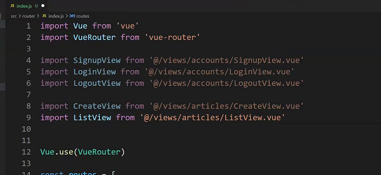
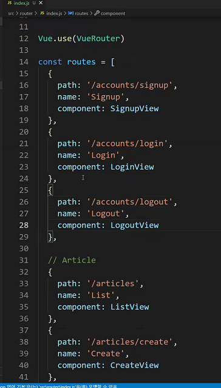
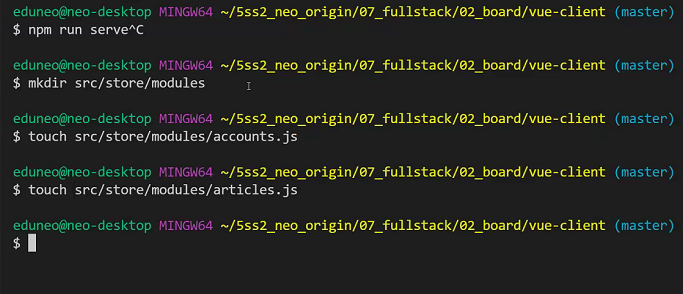
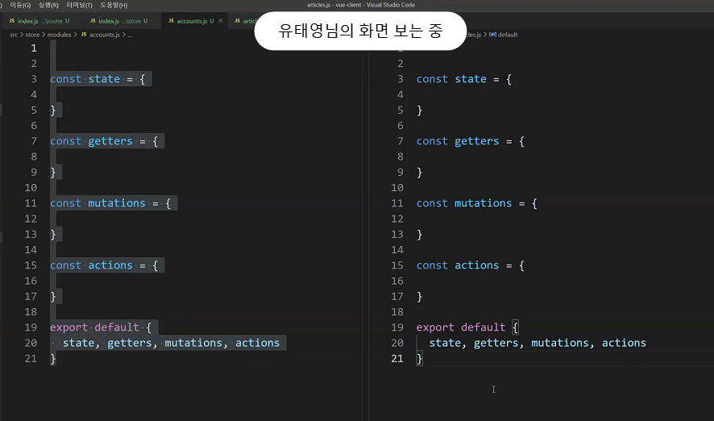

------------------


gitignore 생성


-----------

```
python manage.py startapp board
python manage.py startapp accounts
```


장고 모델 만들기

시리얼라이저 하기


-------


로그인, 로그아웃


싸인업을 제공안해서 이걸 사용

공식문서 참고


이렇게 하고나면 오류가 뜸

make마이그레이션도 필요하고 site_id가 꼭 필요함(문서에서 그랬음)

contrib.sites가 필요하대


all auth에 의해


토큰만 있으면

로그인하고 저장까지 해줌


-----------


api doc에 있음

하라는 대로 하자


permission.isauthenticated 쓰기 너무 기니까


리턴 제대로 하기


-------------------


url을 할당 받은 애들은 view 그 외는 component


전부 등록




라우터 등록




특정 뷰엑스와 관련이 잇는것들을 적을것







errors.js도 만들어주자

