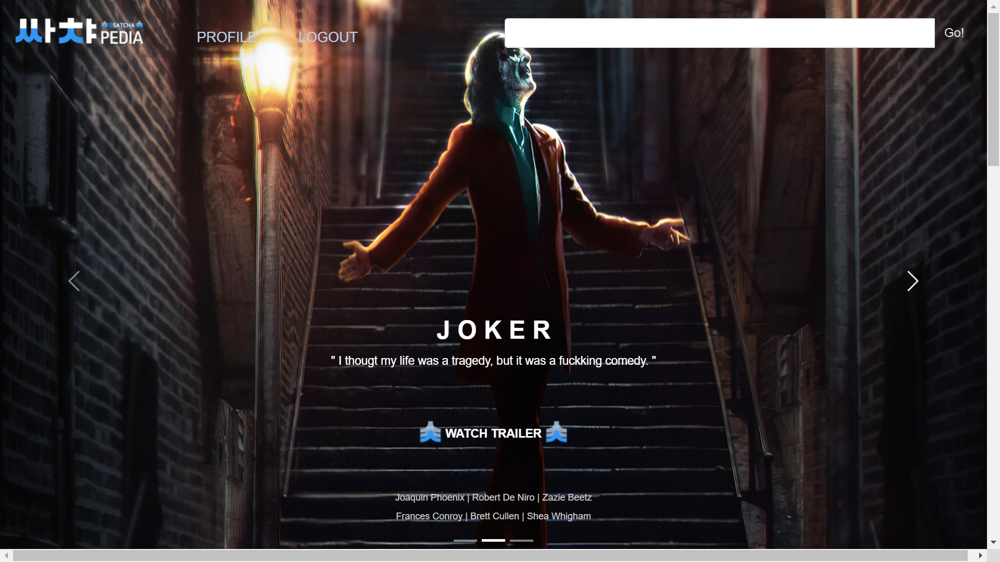
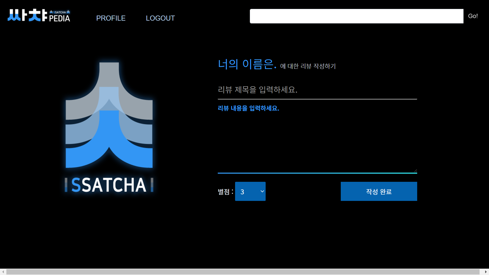

# SSATCHA

- 개발일지 

  https://www.notion.so/SSATCHA-da494cdfe46b4b4787a4bec855d72dbe

<br>

#### 1. 참여자 

	- 박나영
	- 조정원


#### 2. 일정 

```	
21. 05. 20 - 21. 05. 27 
```


#### 3. 프로젝트 개요 

- Vue.js 와 Django를 이용하여 
- TMDB API를 기반으로 
- 영화 추천 서비스를 구현한다


#### 4. 최종 결과물

##### 1) 메인페이지

- 메인페이지 상단

 

```
- INTESTELLAR, JOKER, FROZEN2의 트레일러 사이트로 연결
- Navbar에 위치한 검색창으로 영화를 검색하여 영화 상세 페이지를 확인
```

- 메인페이지 하단


```
TOP RATED, POPULARITY, KOREAN MOVIES 기준 영화 추천
```


##### 2) 영화 세부 페이지


```
- 영화 포스터, 평점, 장르, 개봉일, 줄거리 정보 확인
- 영화 스트리밍 가능사이트, 구매 및 대여 가능 사이트를 아이콘으로 제공 → 클릭시 해당 사이트로 이동
- 영화 '좋아요'와 '싫어요' 버튼
- 리뷰 작성 버튼
- 해당 영화 리뷰 목록
```


##### 3) 리뷰 작성 페이지



```
- 영화에 대한 리뷰 제목, 내용 평점 입력
```


##### 4) 리뷰 상세 페이지


```
- 리뷰에 대한 좋아요, 싫어요 버튼
- 작성자에 한해 리뷰 삭제 버튼

- 댓글 작성, 수정, 삭제 기능
- 댓글에 대한 댓글 작성 기능
```


##### 5) 로그인, 회원가입 페이지


```
- 회원가입 기능(선호 장르 등록 기능)
- 로그인 기능 → 로그인 사용자에 한해 리뷰 작성 기능, 프로필 사이트 접근 가능
```


##### 6) 프로필 페이지


```
- 현재까지 작성한 리뷰, 좋아요를 누른 리뷰, 좋아요를 누른 영화 목록을 확인
- 회원가입시 등록한 영화 장르를 기준으로 개인 맞춤 영화 추천
```


#### 5. 개발과정에서 마주한 고충들 및 잊지 말아야 할 개발기록 

- [회원가입 (Django Rest-Auth customization)](Readme/rest_auth_customize.md)
  - [회원가입시 many-to-many 필드 연결](Readme/many-to-many.md) 
- [Circular import error](Readme/circular_import_error.md) 
- [영화 검색](Readme/search_movie.md) 
- [Broken pipe from ..](Readme/broken_pipe.md)
- [영화 감상 사이트 연결](Readme/web_crawling.md) 

