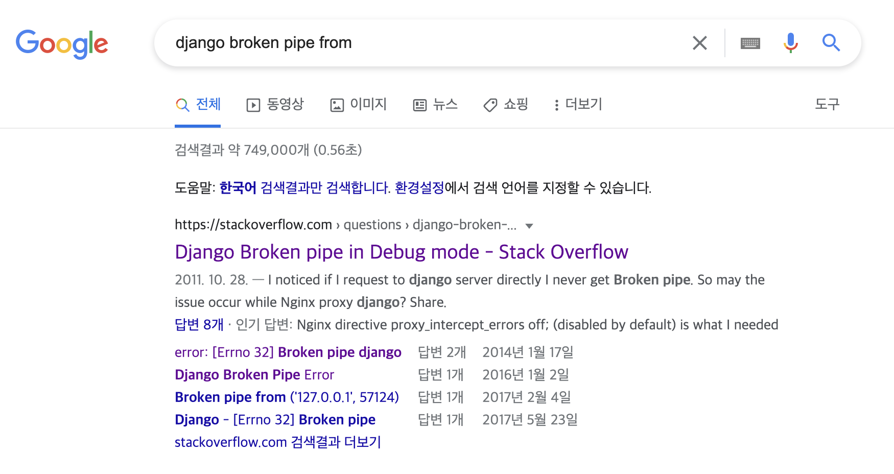

# Django Broken Pipe Error 

어느 순간부터 회원가입 및 로그인 버튼을 누르는 경우 Django 콘솔에서 `Broken Pipe from ... ` 이라고 출력되면서 페이지가 새로고침되는 에러가 발생하였다. 

회원가입의 경우 검증을 통과하게되면 가입은 정상적으로 이루어지지만 새로고침으로 인해서 가입 이후 로그인 상태로 유지되지 않았고, 이로 인해 사용자는 제대로 가입이 되었는지 여부를 확인할 수가 없었다. 

로그인의 경우, Vue 에서 보내는 로그인 요청의 경우 정상적으로 처리되지만, 직후 `Broken Pipe Error` 가 발생하면서 로그인 자체가 이루어지지 않았다. 

흥미로운 사실은 간헐적으로 정상적으로 작동하여 로그인이 되는 경우가 있었다는 것이다.

> 구글링해본 결과 많은 사람들이 동일한 에러로 인해 고통받고 있었다.. 

여러 포스트를 참고한 결과, 해당 에러는 

- 장고 서버측의 문제로 
- 

 

