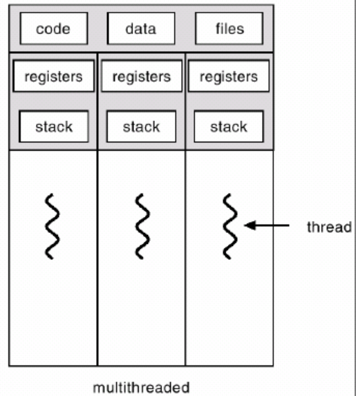

### 임계구역 문제

--------

현재 대부분의 프로그램은 다중 쓰레드이다. 예를 들어 웹 브라우저를 들면 화면을 출력을 시켜주는 프로그램 쓰레드가 있고 데이터를 읽어오는 쓰레드가 따로 존재한다. 두 가지의 쓰레드가 같이 돌고 있으므로 우리가 동시에 할 수 있는 것이다.

한 프로세스 내의 다중 쓰레드는 프로세스의 메모리 공간을 공유(code, data)하고 자원도 공유(file, I/O)를 한다.

프로세스 관리에 중요한 역할은 스케줄링과 동기화이다.

서로간의 프로세스가 접속을 가능할 수 있게 되어 공유하는 데이터에 동시에 접근하면 문제점이 발생할 수 있다. 이런 문제를 해결하기 위한 것이 프로세스의 동기화이다. 서로 Cooperating하는 프로세스 간에 문제가 발생하지 않도록 일관성을 유지시키는 것이 프로세스 동기화이다.

예시로 은행계좌 문제를 들어보자. 부모님과 학생이 있는데 부모님은 은행계좌에 입금을 하고 학생은 출금을 한다고 가정을 하자. 부모님과 학생은 언제든지 자신의 활동을 할 수 있다. 동일한 계좌에 접근을 하므로 부모님과 학생은 Cooperating 관계를 가진다. 그런데 만약 같은 시간에 접근하여 활동을 할 경우 문제가 발생할 수 있다. 이를 예방하기 위한 프로세스 동기화가 필요하다.

. 은행계좌 문제를 통해 공통변수인 은행계좌에 대한 동시 업데이트가 발생하면 문제가 발생할 수 있다. 따라서 우리는 한 번에 한 쓰레드만 업데이트하는 프로세스 동기화가 필요하다. 이러한 문제를 임계구역 문제라고 한다. 여러 개의 쓰레드로 이루어진 시스템에서 각각의 쓰레드는 코드의 영역을 가지고 있는데 이 부분을 임계구역

첫 번째는 상호배타(Mutual exclusion)이다. 오류가 일어나지 않기 위해서는 데이터에 대한 업데이트는 한 순간에 오직 한 쓰레드만이 진행할 수 있다는 것이다. 은행계좌 문제로 보면 부모님이 은행계좌에 돈을 입금하고 있을 시에는 학생은 돈을 인출할 수 없다는 것을 의미한다. 공통적으로 사용하는 은행계좌라는 데이터에 대한 접근이 상호배타적이기 때문이다. 반대의 상황도 마찬가지로 적용된다.

두 번째는 진행(Progress)이다. 두 쓰레드에서 누가 먼저 들어갈 것인가에 대한 결정이 유한 시간 내에 일어나야한다는 조건이다. 은행계좌에 접근하는 것이 부모님과 학생 사이에서 유한한 시간 내에 누구 하나가 먼저 접근을 하도록 결정을 해야 한다는 것이다.

세 번째는 유한대기(Bounded waiting)이다. 유한 대기는 쓰레드가 임계구역에 유한 시간 내에 접근을 해야 한다는 것을 의미한다. 무한한 시간동안 아무도 접근을 하지 않는 경우가 발생해서는 안 된다.

임계구역 문제를 해결하기 위해서는 위의 3가지가 모두 만족하는 방법을 찾아야한다.

동기화를 통해 쓰레드를 제어하기 위해서 도구들이 존재한다. 세마포, 모니터, 맥 등이 있는데 세마포에 대해서 살펴볼 것이다. 세마포는 동기화 문제(임계구역 문제) 해결을 위한 소프트웨어 도구이다. 구조적으로 정수형 변수와 두 개의 동작(P, V)으로 구성되어 있다.

P동작을 호출하게 되면 정수 값이 1만큼 감소되고 값이 0보다 작게 되면 세마포에 존재하는 리스트(Queue)에 쓰레드를 넣고 block시킨다. V동작은 정수 값을 1 증가시키고 리스트에서 쓰레드를 방출한다. 세마포는 메인 메모리에서 쓰레드가 동작할 때 갈 수 있는 또 다른 루트인데 동기화를 위해 존재하는 것이다.

세마포는 동기화의 조건 중에서 상호배타의 역할을 위해서 존재한다.

-----------

부모는 balance라는 공통변수를 증가시키려고 하고 있는데

자식은 balance라는 공통변수를 감소시키려고 하고 있음(withdraw)

도중에 switching이 일어나면서(동일한 값에 대해서 동시에 업데이트를 하려고 함) 문제가 발생

atomic: 더이상 쪼개질 수 없는 원자

한번에 한 쓰레드만 업데이트 하도록

##### 임계구역 문제

여러개의 스레드로 이루어진 시스템에서

각각의 코드영역을 가지고 있음(크리티컬 섹션): 여러스레드들이 공통적으로 사용하는 변수, 테이블, 파일을 바꾸는 것

##### 예시

부모: 무한루프를 들며 balance + n

자식: 무한루프를 돌며 balance - n

두개의 threads

common variable을 업데이트 하는 상태

각각이 크리티칼 섹션

크리티칼 섹션

##### 해결법

1. 상호배타(mutual exclusion): 오직 한 스레드만 진입
2. 진행(progress): 진입 결정은 유한 시간 내 일어나야 함, 누가 먼저 들어갈까
3. 유한대기(bounded waiting): 어느 스레드라도 유한 시간 내 들어갈 수 있어야 함

이 세가지가 전부 만족 되어야  크리티컬 섹션 문제를 해결할 수 ㅇ

##### 프로세스/스레드 동기화

우리가 원하는대로 스레드의 실행순서를 제어하는 것

##### os

1. process management
   - cpu schedule
   - synchronization(동기화)

2. main memory

3. file system

4. i/o

이를 해결하기 위해 학자들이 동기화 도구를 연구함

##### semaphores

깃발과 같음(멈추라고 흔드는)

1960-70년대에 만들어짐

동기화 문제 해결을 위한 소프트웨어도구

구조: 정수형변수 + 두개의 동작

stack은 배열을 넣고 push와 pop을 하듯이

변수와 acquire과 release가 있음

acquire

정수값이 1만큼 감소

0보다 작으면 queue안에 집어넣고 block

release

정수값을 1만큼 증가

0보다 작거나 같으면 queue에서 꺼내서 해방

세마포 큐가 따로 있음

acquire이 호출되면 io queue에 가지 못하고 세마포 큐로 감

release를 호출해서 조건값을 만족하면 세마포 큐에 있는 것 해방해서 ready queue로 보내줌

value가 의미하는 것은 number of permits

##### 예시

##### mutual exclusion

첫번째 프로세스(parent)

1로 두면 -1에 걸리며 critical section안으로 들어감(value : 0)

두번째 프로세스(child)

value가 -1이 되며 queue에 갇히게 됨

release를 통해 +1이 되고

queue에 갇혀있던 것을 꺼내줌

이제 자식이 critical section으로 들어갈 수 있음

queue엔 아무것도 없음

시간 지연은 있을지라도 엉뚱한 결과가 나오는 일은 없음

결과값: balance는 0